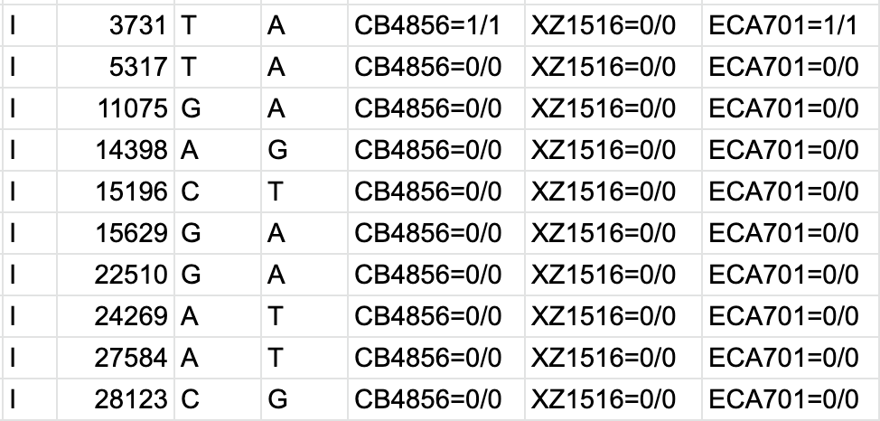

# Command line

[TOC]

[Bash](https://en.wikipedia.org/wiki/Bash_(Unix_shell)) is the default unix shell on Mac OS and most Linux operating systems. Many bioinformatic programs are run using the command line, so becoming familiar with Bash is important.

Start with this [introduction to bash](http://cs.lmu.edu/~ray/notes/bash/). Also check out this [cheatsheet](https://gist.github.com/ssledz/9d244e4d5898fbd217d67bb62bdc22e5)

## Basic Commands

You should familiarize yourself with the following commands.

* __alias__ - create a shortcut for a command
* __cat__ - concatenate files
* __zcat__ - concatenate zipped files
* __cd__ - change directories
* __curl__ - download files
* __echo__ - print strings
* __export__ - Add a variable to the global environment so that they get passed on to child processes.
* __grep__ - filter by pattern
* __egrep__ - filter by regex
* __rm__ - delete files
* __sudo__ - run as an administrator
* __sort__ - sorts files
* __source__ - runs a file
* __ssh__ - connect to servers
* __which__ - locate files on your PATH
* __uniq__ - get unique lines. File must be sorted.

## More Advanced

You should learn these once you have the basics down.

* __git__ - version control
* __awk__ - file manipulation; Filtering; Rearranging columns
* __sed__ - quick find/replace


# Good Guides

Below are some good guides for various bash utilities.

## grep

* [using grep with regular expressions](https://linuxhint.com/grep_egrep_regex/)
* [another regex grep guide](https://linuxize.com/post/regular-expressions-in-grep/)

## awk

* [awk guide](https://linuxconfig.org/learning-linux-commands-awk)
* [awk by example](https://github.com/learnbyexample/Command-line-text-processing/blob/master/gnu_awk.md) - hundreds of examples

### Rearranging columns

```
cat example.tsv | awk -f OFS="\t" '{ print $2, $3, $1 }'
```

The line above will print the second column, the third column and finally the first column.

### Filtering based on criteria

__Print only lines that start with a comment (#) character__

```
cat example.tsv awk '$0 ~ "^#" { print }'
```

## bcftools

*bcftools view*

* __bcftools view <vcf>__ - view VCF
	* __bcftools view -h <vcf>__ - view only header of VCF
	* __bcftools view -H <vcf>__ - view VCF without header
* __bcftools view -s CB4856,XZ1516,ECA701 <vcf>__ - subset vcf for only these three samples
	* __bcftools view -S sample_file.txt <vcf>__ - subset vcf for only samples listed in `sample_file.txt`
* __bcftools view -r III:1-800000 <vcf>__ - subset vcf for a region of interest
	* can also just use `-r III` to get entire chromosome
	* __bcftools view -R regions.txt <vcf>__ - subset vcf for a region(s) of interest in the `regions.txt` file

*bcftools query*

* __bcftools query -l <vcf>__ - print out list of samples in vcf
* Print out contents of vcf in specified format (i.e. tsv):

```
bcftools query -f '%CHROM\t%POS\t%REF\t%ALT[\t%SAMPLE=%GT]\n' <vcf> > out.tsv
```

*Output of above line of code:*



* __bcftools query -i GT=="alt" <vcf>__ - keep rows that include a tag (like a filter)
* __bcftools query -e GT=="ref" <vcf>__ - remove rows that include a tag

!!! Note
	`bcftools query -i/e` are not necessarily opposites. For example, if you have three genotype options (REF, ALT, or NA), including only ALT calls is different than exluding only REF calls...

For more, check out the [bcftools manual](https://samtools.github.io/bcftools/howtos/index.html) and [this cheatsheet](https://gist.github.com/elowy01/93922762e131d7abd3c7e8e166a74a0b)

## Screen

Screen can be used to run things in the background. It is extremely useful if you need to run things on quest without worry that they will be terminated if you log out or get kicked off. This is essential when running __nextflow__ because pipelines can sometimes run for many hours and its likely you will be kicked off in that time or lose your connection.

* [Screen basics](https://www.linode.com/docs/networking/ssh/using-gnu-screen-to-manage-persistent-terminal-sessions)
