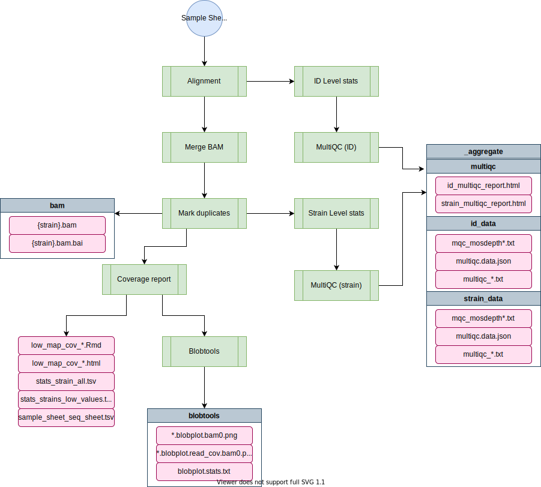
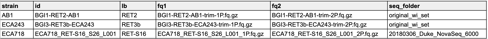

# alignment-nf

[TOC]

The [alignment-nf](https://github.com/AndersenLab/alignment-nf) pipeline performs alignment for wild isolate sequence data __at the strain level__, and outputs BAMs and related information. Those BAMs can be used for downstream analysis including variant calling, [concordance analysis](http://andersenlab.org/dry-guide/pipeline-concordance/), [wi-gatk-nf (variant calling)](http://andersenlab.org/dry-guide/pipeline-wi/) and other analyses.

This page details how to run the pipeline and how to add new wild isolate sequencing data.

!!! Note
    Historically, sequence processing was performed at the isotype level. We are still interested in filtering strains used in analysis at the isotype level, but alignment and variant calling are now performed at the strain level rather than at the isotype level.

# Pipeline overview

```

             ▗▖ ▝▜   ▝                       ▗      ▗▖ ▖▗▄▄▖
             ▐▌  ▐  ▗▄   ▄▄ ▗▗▖ ▗▄▄  ▄▖ ▗▗▖ ▗▟▄     ▐▚ ▌▐
             ▌▐  ▐   ▐  ▐▘▜ ▐▘▐ ▐▐▐ ▐▘▐ ▐▘▐  ▐      ▐▐▖▌▐▄▄▖
             ▙▟  ▐   ▐  ▐ ▐ ▐ ▐ ▐▐▐ ▐▀▀ ▐ ▐  ▐   ▀▘ ▐ ▌▌▐
            ▐  ▌ ▝▄ ▗▟▄ ▝▙▜ ▐ ▐ ▐▐▐ ▝▙▞ ▐ ▐  ▝▄     ▐ ▐▌▐
                         ▖▐
                         ▝▘
    parameters              description                                 Set/Default
    ==========              ===========                                 ========================
    --debug                 Use --debug to indicate debug mode          null
    --sample_sheet          See test_data/sample_sheet for example      null
    --species               Species to map: 'ce', 'cb' or 'ct'          null
    --fq_prefix             Path to fastq if not in sample_sheet        /projects/b1059/data/{species}/WI/fastq/dna/
    --kmers                 Whether to count kmers                      false
    --reference             genome.fasta.gz to use in place of default  defaults for c.e, c.b, and c.t
    --output                Output folder name.                         alignment-{date}

    HELP: http://andersenlab.org/dry-guide/pipeline-alignment/
```



## Software requirements

* Nextflow v20.01+ (see the dry guide on Nextflow [here](quest-nextflow.md) or the Nextflow documentation [here](https://www.nextflow.io/docs/latest/getstarted.html)). On QUEST, you can access this version by loading the `nf20` conda environment prior to running the pipeline command:

```
module load python/anaconda3.6
source activate /projects/b1059/software/conda_envs/nf20_env
```

### Relevant Docker Images

*Note: Before 20220301, this pipeline was run using existing conda environments on QUEST. However, these have since been migrated to docker imgaes to allow for better control and reproducibility across platforms. If you need to access the conda version, you can always run an old commit with `nextflow run andersenlab/alignment-nf -r 20220216-Release`*

* `andersenlab/alignment` ([link](https://hub.docker.com/r/andersenlab/alignment)): Docker image is created within this pipeline using GitHub actions. Whenever a change is made to `env/align.Dockerfile` or `.github/workflows/build_docker.yml` GitHub actions will create a new docker image and push if successful
* `andersenlab/blobtools` ([link](https://hub.docker.com/r/andersenlab/blobtools)): Docker image is created manually, code can be found in the [dockerfile](https://github.com/AndersenLab/dockerfile/tree/master/blobtools) repo.
* `andersenlab/multiqc` ([link](https://hub.docker.com/r/andersenlab/multiqc)): Docker image is created within the [trim-fq-nf](https://github.com/andersenlab/trim-fq-nf/) pipeline using GitHub actions. Whenever a change is made to `env/multiqc.Dockerfile` or `.github/workflows/build_multiqc_docker.yml` GitHub actions will create a new docker image and push if successful

To access these docker images, first load the `singularity` module on QUEST.

```
module load singularity
```

Also, make sure that you add the following code to your `~/.bash_profile`. This line makes sure that any singularity images you download will go to a shared location on `b1059` for other users to take advantage of (without them also having to download the same image).

```
# add singularity cache
export SINGULARITY_CACHEDIR='/projects/b1059/singularity/'
```

!!! Note  
    [mosdepth](https://www.github.com/brentp/mosdepth) is used to calculate coverage. `mosdepth` is available on Linux machines, but not on Mac OSX. That is why the conda environment for the `coverage` process is specified as `conda { System.properties['os.name'] != "Mac OS X" ? 'bioconda::mosdepth=0.2.6' : "" }`. This snippet allows mosdepth to run off the executable present in the `bin` folder locally on Mac OSX, or use the conda-based installation when on Linux.


# Usage

## Testing on Quest

*This command uses a test dataset*

```
nextflow run andersenlab/alignment-nf --debug
```

## Running on Quest

You should run this in a screen session.

*Note: if you are having issues running Nextflow or need reminders, check out the [Nextflow](quest-nextflow.md) page.*

```
nextflow run andersenlab/alignment-nf --sample_sheet <path_to_sample_sheet> --species c_elegans -profile quest
```

# Parameters

## -profile

There are three configuration profiles for this pipeline.

* `local` - Used for local development.
* `quest` - Used for running on Quest.
* `gcp` - For running on Google Cloud (not currently active?).

!!! Note
    If you forget to add a `-profile`, the `quest` profile will be chosen as default

## --sample_sheet

The `sample sheet` for alignment is the output from the [trim-fq-nf](https://github.com/AndersenLab/trim-fq-nf) pipeline. The `sample sheet` **must be tsv formatted**, is the **full path to the sample sheet** (even if it is in your current directory), and has the following columns:

* __strain__ - the name of the strain. Multiple sequencing runs of the same strain are merged together.
* __id__ - A unique ID for each sequencing run. This must be unique for every single pair of FASTQs.
* __lb__ - A library ID. This should uniquely identify a DNA sequencing library.
* __fq1__ - The path to FASTQ1
* __fq2__ - The path to FASTQ2




!!! Note
    Remember that in `--debug` mode the pipeline will use the sample sheet located in `test_data/sample_sheet.tsv`.

The `library` column is a useful tool for identifying errors by variant callers. For example, if the same library is sequenced twice, and a variant is only observed in one sequencing run then that variant may be excluded as a technical / PCR artifact depending on the variant caller being used.

!!! Important
    The alignment pipeline will merge multiple sequencing runs of the same strain into a single bam. However, summary output is provided at both the `strain` and `id` level. In this way, if there is a poor sequencing run it can be identified and removed from a collection of sequencing runs belonging to a strain. **For this reason, it is important that each id be unique and not just the strain name**

!!! Note
    The sample sheet is a critical tool. It allows us to associated metadata with each sequencing run (e.g. isotype, reference strain, id, library). It also allows us to quickly verify that all results have been output. It is much easier than working with a list of files!

## --debug (optional)

You should use `--debug true` for testing/debugging purposes. This will run the debug test set (located in the `test_data` folder) using your specified configuration profile (e.g. local / quest / gcp).

For example:

```
nextflow run andersenlab/alignment-nf -profile quest --debug -resume
```

Using `--debug` will automatically set the sample sheet to `test_data/sample_sheet.tsv`

### --species (optional)

Defaults to "c_elegans", change to "c_briggsae" or "c_tropicalis" to select correct reference file. If species == "c_elegans", a check will be run for the *npr-1* allele. *Note: this process used to happen later in `concordance-nf`, however it was moved up to `alignment-nf` to avoid having to rerun the long `wi-gatk` process if an incorrect strain is included.* 

### --fq_prefix (optional)

Within a sample sheet you may specify the locations of FASTQs using an absolute directory or a relative directory. If you want to use a relative directory, you should use the `--fq_prefix` to set the path that should be prefixed to each FASTQ.

!!! Note
    Previously, this option was `--fqs_file_prefix`

### --kmers (optional)

__default__ = false

Toggles kmer-analysis

### --reference (optional)

A fasta reference indexed with BWA. WS245 is packaged with the pipeline for convenience when testing or running locally.

On Quest, the default references are here:

```
c_elegans: /projects/b1059/data/c_elegans/genomes/PRJNA13758/WS283/c_elegans.PRJNA13758.WS283.genome.fa.gz
c_briggsae: /projects/b1059/data/c_briggsae/genomes/QX1410_nanopore/Feb2020/c_briggsae.QX1410_nanopore.Feb2020.genome.fa.gz
c_tropicalis: /projects/b1059/data/c_tropicalis/genomes/NIC58_nanopore/June2021/c_tropicalis.NIC58_nanopore.June2021.genome.fa.gz
```

!!! Note
A different `--project` and `--wsbuild` can be used with the `--species` parameter to generate the path to other reference genomes such as:
```
nextflow run andersenlab/alignment-nf --species c_elegans --project PRJNA13758 --wsbuild WS280
```

### --ncbi (optional)

__Default__ - `/projects/b1059/data/other/ncbi_blast_db/`

Path to the NCBI blast database used for blobtool analysis. Should not need to change.

### --blob (optional)

Defaults to true. Change to false if you don't need to run blobtool analysis on low coverage strains. This step can take a while, so if you don't need it you might want to exclude it.

### --output (optional)

__Default__ - `alignment-YYYYMMDD`

A directory in which to output results. If you have set `--debug true`, the default output directory will be `alignment-YYYYMMDD-debug`.


# Output

```
├── _aggregate
│   ├── kmers.tsv
│   └── multiqc
│       ├── strain_data/
│       │   ├── mqc_mosdepth-coverage-dist-id_1.txt
│       │   ├── mqc_mosdepth-coverage-per-contig_1.txt
│       │   ├── mqc_mosdepth-coverage-plot-id_1.txt
│       │   ├── mqc_picard_deduplication_1.txt
│       │   ├── mqc_samtools-idxstats-mapped-reads-plot_Counts.txt
│       │   ├── mqc_samtools-idxstats-mapped-reads-plot_Normalised_Counts.txt
│       │   ├── mqc_samtools_alignment_plot_1.txt
│       │   ├── multiqc.log
│       │   ├── multiqc_data.json
│       │   ├── multiqc_general_stats.txt
│       │   ├── multiqc_picard_dups.txt
│       │   ├── multiqc_qualimap_bamqc_genome_results.txt
│       │   ├── multiqc_samtools_flagstat.txt
│       │   ├── multiqc_samtools_idxstats.txt
│       │   ├── multiqc_samtools_stats.txt
│       │   └── multiqc_sources.txt
│       ├── strain_multiqc_report.html
│       ├── id_data/
│       │   └──... (same as strain_data/)
│       └── id_multiqc_report.html
├── bam
│   ├── [strain].bam
│   └── [strain].bam.bai
├── blobtools
│   ├── {strain}.*.blobplot.bam0.png
│   ├── {strain}.*.blobplot.read_cov.bam0.png
│   └── {strain}.*.blobplot.stats.txt
├── software_versions.txt
├── sample_sheet.tsv
├── strain_summary.tsv
├── stats_strain_all.tsv
├── stats_strains_with_low_values.tsv
├── sample_sheet_for_seq_sheet.tsv
├── sample_sheet_for_seq_sheet_ALL.tsv
├── low_map_cov_for_seq_sheet.Rmd
├── low_map_cov_for_seq_sheet.html
└── summary.txt
```

Most files should be obvious. A few are detailed below.

* __software_versions.txt__ - Outputs the software versions used for every process (step) of the pipeline.
* __summary.txt__ - Outputs a summary of the parameters used.
* __sample_sheet.tsv__ - The sample sheet (input file) that was used to produce the alignment directory.
* __strain_summary.tsv__ - A summary of all strains and bams in the alignment directory.
* __aggregate__ - Stores data that has been aggregated across all strains or sequencing IDs. 
* __coverage__ - Contains coverage data at the strain or id level, presented in a variety of ways.
* __low_map_cov_for_seq_sheet.(Rmd/html)__ - Report showing low coverage or problematic strains to remove.
* __stats_strain_all.tsv__ - contains stats for all strains, with all replicates combined
* __stats_strains_with_low_values.tsv__ - contains stats for strains with either (1) low number of reads, (2) low mapping rate, and/or (3) low coverage
* __sample_sheet_for_seq_sheet.tsv__ - sample sheet to be added to google sheet, filtered to remove low coverage strains
* __sample_sheet_for_seq_sheet_ALL.tsv__ - sample sheet to be added to google sheet, contains all strains (use this one)
* __blobplot/__ - contains plots for low coverage strains to see if they show contamination issues and if they should be resequenced.
* __npr1_allele_strain.tsv__ - if species == c_elegans, this file will be output to show problematic strains that contain the N2 *npr-1* allele and should be manually checked. 

!!! Important
    If a new strain is flagged in the `npr1_allele_strain.tsv file`, tell Erik, Robyn, and the wild isolate team ASAP so they can address the issue. This strain will likely be removed from further analysis.

# Data storage

## Cleanup

Once the `alignment-nf` pipeline has completed successfully and you have removed low coverage strains (see [pipeline overview](pipeline-overview.md)), all BAM files can be moved to `/projects/b1059/data/{species}/WI/alignments/` prior to variant calling.

!!! Note
Low coverage or otherwise problematic BAM files can be moved to `/projects/b1059/data/{species}/WI/alignments/_bam_not_for_cendr/`. Make sure to update the `_README.md` file in this folder with the reason each BAM was moved here. This will help remind people which files might be used again in the future.

---

# Archive

The following sections have been integrated into other code that no longer needs to be run manually, but I am keeping the documentation here in case we need to go back to it. It is important to always check that the sample sheet is generated appropriately. If there are errors in teh sample sheet, one can be constructed manually using the following code:

### construct_sample_sheet.sh

The `scripts/construct_sample_sheet.sh` script generates the `WI_sample_sheet.tsv` file. 

!!! Warning
    The `WI_sample_sheet.tsv` file should never be generated and/or edited by hand. It should only be generated using the `scripts/construct_sample_sheet.tsv` script.

The `construct_sample_sheet.sh` script does a few things.

__(1) Parses FASTQ Filenames__

Unfortunately, no two sequencing centers are alike and they use different formats for naming sequencing files. For example:

```
ECA768_RET-S11_S79_L001_2P.fq.gz      [strain]_[lib_lib#]_[sample_#]_[lane]_[read].fq.gz
XZ1734_S573_L007_2P.fq.gz             [strain]_[sample_#]_[lane]_[read].fq.gz
```

In some cases they even changed formats over time!

The script parses the FASTQ filenames from different sequencing centers, extracting the strain name, and a unique ID. Note that the `library` and unique sequencing run ID (`id`) are named somewhat arbitrarily. The most imporant aspect of these columns is that any DNA library that has been sequenced multiple times possess the same `library`, and that every pair of FASTQs possess a unique sequencing ID.

Consider the following (fake) example:

| strain   | isotype   | reference_strain   | id            | library   |
|:---------|:----------|:-------------------|:--------------|:----------|
| AB1      | AB1       | TRUE               | BGI2-RET2-AB1 | RET2      |
| AB1      | AB1       | TRUE               | BGI2-RET3-AB1 | RET3      |
| AB4      | CB4858    | FALSE              | BGI1-RET2-AB4 | RET2      |
| AB4      | CB4858    | FALSE              | BGI2-RET2-AB4 | RET2      |

`AB1` was sequenced twice, however two different DNA libraries were produced for each sequencing run (`RET2` and `RET3`). `AB4` was also sequenced twice, but both sequencing runs were of the same DNA library (called `RET2`). Note that the `id` column is always unique across all sequencing runs.

If you look at the `WI_sample_sheet.tsv` in more detail you will observe that the `id` and `library` columns are not consistantly named. This is not ideal, but it works. The inconsistancy does not affect analysis, and exists because the filenames are not consistant, but unique library and sequencing run IDs must be derived from them.

__(2) Clean up strain names__

The second thing the `construct_sample_sheet.sh` script does is that it replaces shorthand strain names or innapropriately named strains with the 3-letter system. For example, `N2Baer` is renamed to `ECA254`.

__(3) Integrate metadata__

The `C. elegans WI Strain Info` google spreadsheet is a master spreadlist containing every strain, reference_strain, and isotype for _C. elegans_ wild isolates. The script downloads this dataset and uses it to integrate the isotype and reference strain into the sample sheet.

### Adding new sequencing datasets

Sequencing data should be added to QUEST and processed through the trimming pipeline before being added to `WI_sample_sheet.tsv`. Before proceeding, be sure to read [pipeline-trimming](/pipeline-trimming/)

To add new sequencing datasets you will need to devise a strategy for extracting the strain name, a unique ID, and sequencing library from the FASTQ filenames. This may be the same as a past dataset, in which case you can append the sequencing run folder name to the list with that format. Alternatively, you may need to create a custom set of bash commands for generating the rows corresponding to each FASTQ pair.

Here is an example from the `construct_sample_sheet.sh` script.

```bash
#===================================#
# BGI-20161012-ECA23                #
#===================================#

out=`mktemp`
seq_folder=BGI-20161012-ECA23
>&2 echo ${seq_folder}
prefix=${fastq_dir}/WI/dna/processed/$seq_folder
for i in `ls -1 $prefix/*1P.fq.gz`; do
    bname=`basename ${i}`;
    barcode=`zcat ${i} | grep '@' | cut -f 10 -d ':' | sed 's/_//g' | head -n 100 | uniq -c | sort -k 1,1n | cut -c 9-100 | tail -n 1`
    echo -e "${bname}\t${i}\t${barcode}" >> ${out}
done;

cat ${out} |\
awk -v prefix=${prefix} -v seq_folder=${seq_folder} '{
    fq1 = $1;
    fq2 = $1;
    LB = $3;
    gsub("N", "", LB);
    gsub("1P.fq.gz", "2P.fq.gz", fq2);
    ID = $1;
    gsub("_1P.fq.gz", "", ID);
    split(ID, a, "[-_]")
    SM=a[2];
    print SM "\t" ID "\t" LB "\t" prefix "/" fq1 "\t" prefix "/" fq2 "\t" seq_folder;
}' >> ${fq_sheet}
```

Notes on this snippet:

* `SM`=`strain`, `LB`=`library`, and `ID`=`id` in the final output file.
* The sequencing run is listed in the comment box at the top.
* Barcodes are extracted from each FASTQ in the first forloop. These are used to define the `library`.
* The `id` is defined using the basename of the file.
* A final column corresponding to the `seq_folder` is always added.

