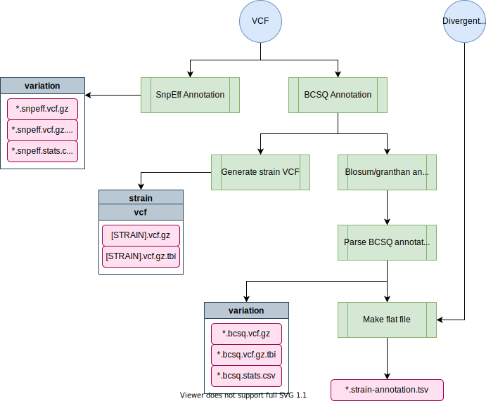

# annotation-nf

[TOC]

The [annotation-nf](https://github.com/AndersenLab/annotation-nf) pipeline performs variant annotation for the VCF at the isotype level using both [SnpEff](http://pcingola.github.io/SnpEff/) and [BCFtools/csq (BCSQ)](https://samtools.github.io/bcftools/howtos/csq-calling.html).

!!! Note
    Before running, make sure to check out the [genomes-nf](pipeline-genomes-nf.md) pipeline to ensure that the reference genome and annotation databases are set up properly.

# Pipeline overview

```
-------------    
ANNOTATION-NF
-------------

nextflow andersenlab/annotation-nf --debug

nextflow andersenlab/annotation-nf --vcf=hard-filtered.vcf --species=c_elegans --divergent_regions=divergent_regions_strain.bed

    parameters           description                                              Set/Default
    ==========           ===========                                              ========================
    --debug              Set to 'true' to test                                    ${params.debug}
    --species            Species: 'c_elegans', 'c_tropicalis' or 'c_briggsae'     ${params.species}
    --vcf                hard filtered vcf to calculate variant density           ${params.vcf}
    --divergent_regions  (Optional) Divergent region bed file                     ${params.divergent_regions}
    --reference          Reference used based on species and project              ${params.reference}
    --output             (Optional) output folder name                            ${params.output}
 
    username                                                                      ${"whoami".execute().in.text}

    HELP: http://andersenlab.org/dry-guide/pipeline-annotation-nf
```



## Software Requirements

* The latest update requires Nextflow version 20.0+. On QUEST, you can access this version by loading the `nf20_env` conda environment prior to running the pipeline command:

```
module load python/anaconda3.6
source activate /projects/b1059/software/conda_envs/nf20_env
```

Alternatively you can update Nextflow by running:

```
nextflow self-update
```

### Relevant Docker Images

*Note: Before 20220301, this pipeline was run using existing conda environments on QUEST. However, these have since been migrated to docker imgaes to allow for better control and reproducibility across platforms. If you need to access the conda version, you can always run an old commit with `nextflow run andersenlab/annotation-nf -r 20220216-Release`*

* `andersenlab/annotation` ([link](https://hub.docker.com/r/andersenlab/annotation)): Docker image is created within this pipeline using GitHub actions. Whenever a change is made to `env/annotation.Dockerfile` or `.github/workflows/build_docker.yml` GitHub actions will create a new docker image and push if successful
* `andersenlab/r_packages` ([link](https://hub.docker.com/r/andersenlab/r_packages)): Docker image is created manually, code can be found in the [dockerfile](https://github.com/AndersenLab/dockerfile/tree/master/r_packages) repo.

To access these docker images, first load the `singularity` module on QUEST.

```
module load singularity
```

Also, make sure that you add the following code to your `~/.bash_profile`. This line makes sure that any singularity images you download will go to a shared location on `b1059` for other users to take advantage of (without them also having to download the same image).

```
# add singularity cache
export SINGULARITY_CACHEDIR='/projects/b1059/singularity/'
```


# Usage

!!! Note
  For more info about running Nextflow pipelines in the Andersen Lab, check out [this page](quest-nextflow.md)

## Testing on Quest

*This command uses a test dataset*

```
nextflow run andersenlab/annotation-nf --debug
```

## Running on Quest

*Note: if you are having issues running Nextflow or need reminders, check out the [Nextflow](quest-nextflow.md) page.*


You should run this in a screen session.

```
nextflow run andersenlab/annotation-nf --vcf <path_to_vcf> --species <species> --divergent_regions <path_to_file>
```

# Parameters

## --debug

You should use `--debug true` for testing/debugging purposes. This will run the debug test set (located in the `test_data` folder).

For example:

```
nextflow run andersenlab/annotation-nf --debug
```

## --vcf

Path to the hard-filter, isotype VCF (output from `post-gatk-nf`)

## --species

Choose from c_elegans, c_briggsae, or c_tropicalis. Species will specifiy a default reference genome. You can select a different one if you prefer (see below)

## --divergent_regions

This is the `divergent_regions_strain.bed` file output from the `post-gatk-nf` pipeline. This file is used to add a column to the flat file if the variant is within a divergent region. Currently, *C. elegans* is the only species with divergent regions, if running for another species, do not provide a divergent_regions file and the pipeline will ignore it.

### --reference, --project, --ws_build (optional)

By default, the reference genome is set by the species parameter. If you don't want to use the default, you could change the project and/or ws_build. As long as the genome is in the proper location on quest (for more, see the [genomes-nf](pipeline-genomes-nf.md) pipeline), this will work. Alternatively, you could provide the path to a reference of your choice.

**Defaults:**
- *C. elegans* - `/projects/b1059/data/c_elegans/genomes/PRJNA13758/WS276/c_elegans.PRJNA13758.WS276.genome.fa.gz`
- *C. briggsae* - `/projects/b1059/data/c_briggsae/genomes/QX1410_nanopore/Feb2020/c_briggsae.QX1410_nanopore.Feb2020.genome.fa.gz`
- *C. tropicalis* - `/projects/b1059/data/c_tropicalis/genomes/NIC58_nanopore/June2021/c_tropicalis.NIC58_nanopore.June2021.genome.fa.gz`

### --ncsq_param (optional)

This parameter is necessary for correct annotation using BCSQ for variants with many different annotations (like found in divergent regions). In 20210121 we found that the default value of `224` was sufficient, but as more strains are added this number might need to increase. If there is an issue, you should see a warning error from BCFtools and they should suggest what to change this parameter to.

# Output

```
├── strain_vcf
│   ├── {strain}.{date}.vcf.gz
│   └── {strain}.{date}.vcf.gz.tbi
└── variation
    ├── WI.{date}.hard-filter.isotype.snpeff.vcf.gz
    ├── WI.{date}.hard-filter.isotype.snpeff.vcf.gz.tbi
    ├── snpeff.stats.csv
    ├── WI.{date}.hard-filter.isotype.bcsq.vcf.gz
    ├── WI.{date}.hard-filter.isotype.bcsq.vcf.gz.tbi
    ├── WI.{date}.hard-filter.isotype.bcsq.vcf.gz.stats.txt 
    └── WI.{date}.strain-annotation.bcsq.tsv
 
```
# Data storage

## Cleanup

Once the pipeline has complete successfully and you are satisfied with the results, the final data can be moved to their final storage place on Quest accordingly:

* Both the `strain_vcf` and the `variation` folders can be moved to `/projects/b1059/data/{species}/WI/variation/{date}/vcf`
* If applicable, all snpeff `.bed` files (HIGH, LOW, MODERATE, etc.) can be moved to `/projects/b1059/data/{species}/WI/variation/{date}/tracks/` (*As of 20210901 this is no longer being produced for CeNDR*)

## Updating CeNDR and NemaScan

Check out the [CeNDR](cendr.md) page and the [WI protocol](https://katiesevans9.notion.site/Wild-isolate-sequence-analysis-protocol-00e76cc7f55f4bf6ab644dd99c883727) for more information about updating a new data release for CeNDR.

