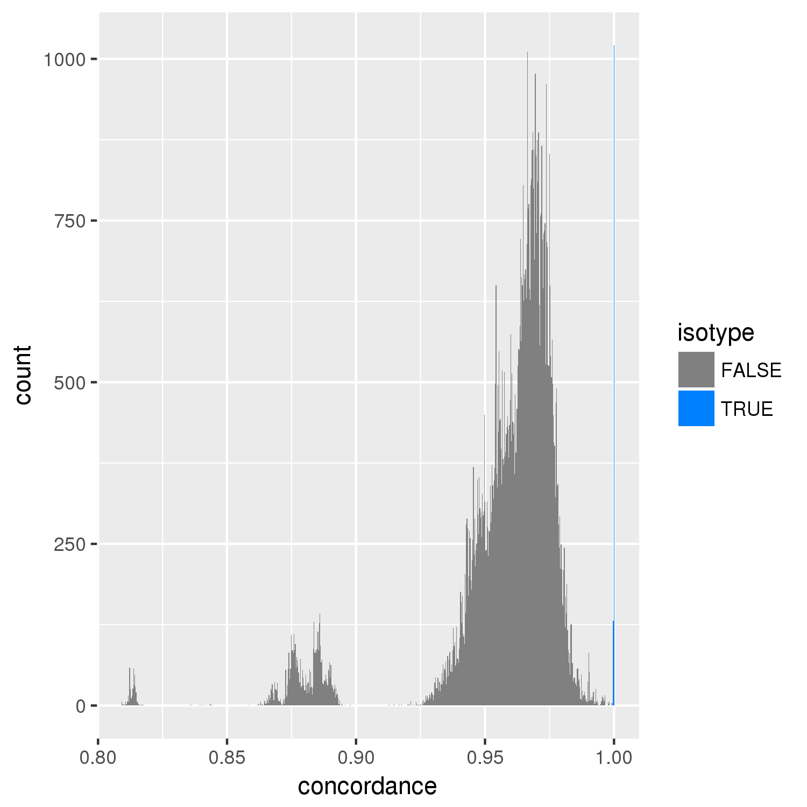

# concordance-nf

The `concordance-nf` pipeline...

[TOC]

## Usage

```

    ┌─┐┌─┐┌┐┌┌─┐┌─┐┬─┐┌┬┐┌─┐┌┐┌┌─┐┌─┐  ┌┐┌┌─┐
    │  │ │││││  │ │├┬┘ ││├─┤││││  ├┤───│││├┤ 
    └─┘└─┘┘└┘└─┘└─┘┴└──┴┘┴ ┴┘└┘└─┘└─┘  ┘└┘└  
                                                        
    parameters              description                    Set/Default
    ==========              ===========                    =======

    --debug                 Set to 'true' to test          false
    --cores                 Regular job cores              4
    --out                   Directory to output results    concordance-<todays date>
    --sample_sheet          fastq file (see help)          sample_sheet.tsv
    --fq_prefix             fastq file (see help)          null
    --reference             Reference Genome               WS245/WS245.fa.gz
    --bamdir                Location for bams              bam
    --tmpdir                A temporary directory          tmp/
    --email                 Email to be sent results

    HELP: http://andersenlab.org/dry-guide/pipeline-concordance/

```

## Overview


The concordance pipeline is used to detect sample swaps, identify samples with quality issues, and determine which wild isolate strains should be grouped together as an isotype. When performing sequencing, we often sequence the same DNA library or strain multiple times in order to attain adequate coverage. To ensure that samples are labeled properly we examine whether they contain discordant variant calls based on what strain they are labeled as. 

The `concordance-nf` pipeline will proceed to group FASTQs labeled as a strain regardless of the quality of the data. Therefore, if issues are suspected the problemetic data needs to be removed and the pipeline rerun. More details are available below.

To determine which strains belong to the same isotype we use two criteria. First we look at the strains that group together with a concordance threshold of 99.9%. Generally this will group most isotypes without issue. However, it is possible that you will run into cases where the grouping is not clean. For example, strain A groups with B, B groups with C, but C does not group with A. In these cases you must examine the data closely to identify why strains are incompletely grouping. Our second criteria we use to group isotypes may address these types of groupings.

The second criteria that we use to group isotypes regards looking for regional differences among strains. If two strains are similar but possess a region of their genome (binned at 1 Mb) that differs by more than 2% then we will separate them out into their own isotypes.

__The process of grouping isotypes is very hand-on. This pipeline will help process the data but you must carefully review the output and investigate closely.__


!!! note
    There is at least one exception to the 99.9% cutoff rule we use to determine isotypes.

    We classify LSJ1 and N2 as separate isotypes despite the fact that they are greater than 99.9% identical. The strains are known to have diverged from one another, but work has demonstrated significant
    genetic and phenotypic differences.


## Usage

The `nextflow.config` file sets most of the defaults you need to get the pipeline running locally for debugging purposes or on Quest.

### Debugging the pipeline locally

The pipeline comes with a test dataset that you can use to make changes or fix problems. When running locally, you should install the [andersen-lab-env](quest-andersen-lab-env.md) which will install all the required dependencies.

__Fetching the reference__

You will need a reference genome to align to. You can fetch one by running the following command:

```
curl https://storage.googleapis.com/elegansvariation.org/genome/WS245/WS245.tar.gz > WS245.tar.gz
tar -xvzf WS245.tar.gz
```

Run the pipeline locally by setting `-profile debug`:

```
nextflow run main.nf -profile debug -resume
```

### Debugging the pipeline on Quest

When running on Quest, you should first run the quest debug profile. The Quest debug profile will use the test dataset and sample sheet which runs much faster and will encounter errors much sooner should they need to be fixed. If the debug dataset runs to completion it is likely that the full dataset will as well.

```
nextflow run main.nf -profile quest_debug -resume --email <your email>
```

### Running the pipeline on Quest

The pipeline can be run on Quest using the following command:

```
nextflow run main.nf -profile quest -resume --email <your email>
```

# Parameters

The nextflow profiles configured in `nextflow.config` are designed to make it so that you don't need to change the parameters. However, the pipeline offers this flexibility if it is ever called for.

## --cores

The number of cores to use during alignments and variant calling.

## --out

A directory in which to output results. By default it will be `concordance-YYYY-MM-DD` where YYYY-MM-DD is todays date.

## --sample_sheet

The sample sheet to use. Normally you can use the `sample_sheet.tsv` located in the base of the repo. This sample sheet is constructed usign `scripts/construct_sample_sheet.sh`.

When running with `-debug` the sample sheet located in `test_data/sample_sheet.tsv` will be used.

More information on the sample sheet and adding new sequence data on the [Sample sheet page](sample-sheets.md) section.

## --fq_prefix

A prefix path for FASTQs defined in the sample sheet. The sample sheet designed for usage on Quest (`sample_sheet.tsv`) uses absolute paths so no FASTQ prefix is necessary. It is set to `null` by default.

## --reference

A fasta reference indexed with BWA. On Quest, the reference is available here:

```
/projects/b1059/data/genomes/c_elegans/WS245/WS245.fa.gz
```

## --tmpdir

A directory for storing temporary data.

## --bamdir

A directory to output strain-level BAM files to. On Quest this is set by default to

`/projects/b1059/data/alignments/WI/strain/`

## --email

Set an email to get notified when the pipeline succeeds or fails.

# Output

## Concordance/

### __concordance.png__



An image showing the distribution of pairwise concordances across all strains. The cutoff is at 99.9% above which pairs are considered to be in the same isotype unless issues arise.

### __concordance_above_99.png__


A close up view of the concordances showing more detail. 

### __isotype_groups.tsv__

__This is the most important output file__. It illustrates the isotypes identified for each strain and identifies potential issues.

A file with the following structure:

|   group | strain   | isotype   |   latitude |   longitude |   coverage |   unique_isotypes_per_group |   unique_groups_per_isotype | strain_in_multiple_isotypes   | location_issue   | strain_conflict   |
|--------:|:---------|:----------|-----------:|------------:|-----------:|----------------------------:|----------------------------:|:------------------------------|:-----------------|:------------------|
|       1 | AB1      | AB1       |   -34.93   |     138.59  |    69.4687 |                           1 |                           1 | FALSE                         | FALSE            | FALSE             |
|     112 | AB4      | CB4858    |   -34.93   |     138.59  |   158.358  |                           1 |                           1 | FALSE                         | TRUE             | TRUE              |
|     112 | ECA251   | CB4858    |    34.1    |    -118.1   |    73.5843 |                           1 |                           1 | FALSE                         | TRUE             | TRUE              |
|     112 | JU1960   | CB4858    |    34.1897 |    -118.131 |    55.0373 |                           1 |                           1 | FALSE                         | TRUE             | TRUE              |
|     175 | BRC20067 | BRC20067  |    24.073  |     121.17  |    33.5934 |                           1 |                           1 | FALSE                         | FALSE            | FALSE             |
|     175 | BRC20113 | BRC20067  |    24.1242 |     121.283 |    38.9916 |                           1 |                           1 | FALSE                         | FALSE            | FALSE             |
|     186 | BRC20231 | MY23      |    23.5415 |     120.908 |    44.1452 |                           1 |                           1 | FALSE                         | TRUE             | TRUE              |
|     186 | MY23     | MY23      |    51.96   |       7.53  |   132.185  |                           1 |                           1 | FALSE                         | TRUE             | TRUE              |


* __group__ - A number used to group strains (in each row) into an isotype automatically. This number should be unique with the isotype column (e.g. 1--> AB1, 112 --> CB4858, BRC20067 --> 175). The number can change between analyses.
* __strain__ - the strain
* __isotype__ - the currently assigned isotype for a strain taken from the `WI Strain Info` spreadsheet. When new strains are added this is blank. 
* __latitude__
* __longitude__
* __coverage__ - Depth of coverage for strain.
* __unique\_isotypes\_per\_group__ - Number of unique isotypes when grouping by the group column. This should be 1. If it is more than 1, it indicates that multiple isotypes were assigned to a grouping and that a previously assigned isotype is now being called into question.
* __unique\_groups\_per\_isotype__ Number of unique groups assigned to an isotype. This should be 1. If it is higher than 1, it indicates that a strain is concordant with strains in two different isotypes (including blanks). If it is equal to 2 and contains blanks in the isotype column it likely means that an isotype should be assigned to that strain.
* __strain\_in\_multiple\_isotypes__ - Indicates that a strain is falling into multiple isotypes (a problem!).
* __location\_issue__ - Indicates a location issue. This occurs when strains fall into an isotype but are located far away from one another. Some are known issues and can be ignored.
* __strain\_conflict__ - `TRUE` if any issue is present that should be investigated.

### gtcheck

File produced using `bcftools gtcheck`; Raw genotype differences between strains.

### isotype_count.txt

Gives a count of the number of isotypes identified.

### Heterozygosity

Number of heterozygous sites/strain. Can be an indicator of mixed samples or other issues.

### fq_concordance.tsv

Intra-strain FASTQ-pair concordances. The format is:

### concordance/pairwise/ (directory)

Contains images showing locations where regional discordance occurs among strains classified as being the isotype. You must look through all these images to ensure there are no strains being grouped that have regions with significant differences (> 2%). The image below illustrates an example of this. ED3049 and ED3046 are highly similar (> 99.9%). However, they differ in a region on the right arm of chromosome II. We believe this was enough reason to consider them separate isotypes.


## Duplicates/

### bam_duplicates.tsv

Summary of duplicate reads (determined by picard).

## fq/

The following files are output in the fastq directory

```
fq_bam_idxstats.tsv   # Stats generated with `samtools idxstats`
fq_bam_stats.tsv      # Stats generated with `samtools stats`
fq_coverage.full.tsv  # Detailed coverage numbers
fq_coverage.tsv       # Summary coverage of individual fastqs.
```

## strain/

The following files are output in the strain directory

```
strain_bam_idxstats.tsv   # Stats generated with `samtools idxstats`
strain_bam_stats.tsv      # Stats generated with `samtools stats`
strain_coverage.full.tsv  # Detailed coverage numbers
strain_coverage.tsv       # Summary coverage for strains.
```

## variation/

### sitelist.tsv.gz(+tbi)

The union-variant sitelist from all strains.

### union_vcf.txt

Locations of the union VCFs.

### merged.raw.vcf.gz(+csi)

The raw VCF. The following filters are applied before calculating concordance:

```
    min_depth>3        # Minimum Depth
    qual>30            # Quality (VCF=QUAL)
    mq>40              # Mapping Quality
    dv_dp=0.5          # DV/DP > 0.5 (high-quality allelic ALT bases over total depth)
    max_missing<0.05   # Max number of missing sites cannot exceed 5%
```

### concordance.vcf.gz(+csi)

Filtered VCF, filtered for true SNPs (no monomorphic sites)

### concordance.stats

Stats from concordance vcf. Contains the number of SNPs.
