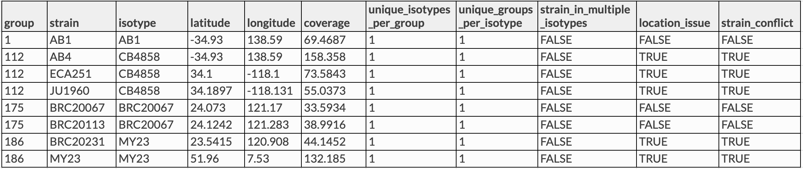

# concordance-nf

[TOC]

The [`concordance-nf`](https://github.com/AndersenLab/concordance-nf) pipeline is used to detect sample swaps and determine which wild isolate strains should be grouped together as an isotype. 

To determine which strains belong to the same isotype we use two criteria. First we look at the strains that group together with a concordance threshold of 99.95%. Generally this will group most isotypes without issue. However, it is possible that you will run into cases where the grouping is not clean. For example, strain A groups with B, B groups with C, but C does not group with A. In these cases you must examine the data closely to identify why strains are incompletely grouping. Our second criteria we use to group isotypes may address these types of groupings.

The second criteria that we use to group isotypes regards looking for regional differences among strains. If two strains are similar but possess a region of their genome (binned at 1 Mb) that differs by more than 2% then we will separate them out into their own isotypes.

__The process of grouping isotypes is very hand-on. This pipeline will help process the data but you must carefully review the output and investigate closely.__

# Pipeline overview

```

    ┌─┐┌─┐┌┐┌┌─┐┌─┐┬─┐┌┬┐┌─┐┌┐┌┌─┐┌─┐  ┌┐┌┌─┐
    │  │ │││││  │ │├┬┘ ││├─┤││││  ├┤───│││├┤ 
    └─┘└─┘┘└┘└─┘└─┘┴└──┴┘┴ ┴┘└┘└─┘└─┘  ┘└┘└  
                                                        
    parameters              description                                                             Set/Default
    ==========              ===========                                                             =======

    --debug                 Set to 'true' to test                                                   false
    --cores                 Regular job cores                                                       4
    --out                   Directory to output results                                             concordance-{date}
    --vcf                   Hard filtered vcf                                                       null
    --bam_coverage          Table with "strain" and "coverage" as header                            null
    --info_sheet            Strain sheet containing exisiting isotype assignment                    null
    --species               'c_elegans' will check for npr1. All other values will skip this        null
    --concordance_cutoff    Cutoff of concordance value to count two strains as same isotype        0.9995

```


## Software Requirements

* The latest update requires Nextflow version 20.0+. On QUEST, you can access this version by loading the `nf20` conda environment prior to running the pipeline command:

```
module load python/anaconda3.6
source activate /projects/b1059/software/conda_envs/nf20_env
```

Alternatively you can update Nextflow by running:

```
nextflow self-update
```

### Relevant Docker Images

*Note: Before 20220301, this pipeline was run using existing conda environments on QUEST. However, these have since been migrated to docker imgaes to allow for better control and reproducibility across platforms. If you need to access the conda version, you can always run an old commit with `nextflow run andersenlab/concordance-nf -r 20220216-Release`*

* `andersenlab/concordance` ([link](https://hub.docker.com/r/andersenlab/concordance)): Docker image is created within this pipeline using GitHub actions. Whenever a change is made to `env/concordance.Dockerfile` or `.github/workflows/build_docker.yml` GitHub actions will create a new docker image and push if successful

To access these docker images, first load the `singularity` module on QUEST.

```
module load singularity
```

Also, make sure that you add the following code to your `~/.bash_profile`. This line makes sure that any singularity images you download will go to a shared location on `b1059` for other users to take advantage of (without them also having to download the same image).

```
# add singularity cache
export SINGULARITY_CACHEDIR='/projects/b1059/singularity/'
```


# Usage

## Profiles

The `nextflow.config` file included with this pipeline contains three profiles. These set up the environment for testing local development, testing on Quest, and running the pipeline on Quest.

* `local` - Used for local development. Uses the docker container.
* `debug` - Runs a small subset of available test data. Should complete within a couple of minutes. For testing/diagnosing issues on Quest.
* `quest` - Runs the entire dataset.

!!! Note
    If you forget to add a `-profile`, the `quest` profile will be chosen as default

## Debugging the pipeline on Quest

When running on Quest, you should first run the quest debug profile. The Quest debug profile will use the test dataset and sample sheet which runs much faster and will encounter errors much sooner should they need to be fixed. If the debug dataset runs to completion it is likely that the full dataset will as well.

```
nextflow run andersenlab/concordance-nf -profile debug -resume
```

## Running the pipeline on Quest

*Note: if you are having issues running Nextflow or need reminders, check out the [Nextflow](quest-nextflow.md) page.*


The pipeline can be run on Quest using the following command:

```
nextflow run andersenlab/concordance-nf -profile quest --bam_coverage <path_to_file> --vcf <path_to_file> --species c_elegans 
```

# Parameters

The nextflow profiles configured in `nextflow.config` are designed to make it so that you don't need to change the parameters. However, the pipeline offers this flexibility if it is ever called for.

## --bam_coverage

The sample sheet to use. This is generally the same sample sheet used for `wi-gatk`. The sample sheet should look like this:


!!! Important
    It is essential that you always use the pipelines and scripts to generate this sample sheet and **NEVER** manually. There are lots of strains and we want to make sure the entire process can be reproduced.

## --vcf

The hard-filtered VCF output from `wi-gatk`.

### --species (optional)

Common options include 'c_elegans', 'c_briggsae', and 'c_tropicalis'.

### --concordance_cutoff (optional)

Cutoff to use to determine isotype groups. Default is 0.9995.

### --cores (optional)

The number of cores to use during alignments and variant calling.

### --out (optional)

A directory in which to output results. By default it will be `concordance-YYYYMMDD` where YYYYMMDD is todays date.


# Output

```

├── concordance
    ├── gtcheck.tsv
    ├── isotype_count.txt
    ├── isotype_groups.tsv
    ├── problem_strains.tsv
    ├── WI_metadata.tsv
    ├── concordance.pdf/png
    ├── xconcordance.pdf/png
    └── pairwise
        └── within_group
                └── {isotype_group}.{isotype}.{strain1}_{strain2}.png


```

* __concordance.png/pdf__ - An image showing the distribution of pairwise concordances across all strains. The cutoff is at 99.9% above which pairs are considered to be in the same isotype unless issues arise.


* __xconcordance.png/pdf__ - A close up view of the concordances showing more detail. 


* __isotype_groups.tsv__ - _This is the one of the most important output files_. It illustrates the isotypes identified for each strain and identifies potential issues.

A file with the following structure:



* __group__ - A number used to group strains (in each row) into an isotype automatically. This number should be unique with the isotype column (e.g. 1--> AB1, 112 --> CB4858, BRC20067 --> 175). The number can change between analyses.
* __strain__ - the strain
* __isotype__ - the currently assigned isotype for a strain taken from the `WI Strain Info` spreadsheet. When new strains are added this is blank. 
* __latitude__
* __longitude__
* __coverage__ - Depth of coverage for strain.
* __unique\_isotypes\_per\_group__ - Number of unique isotypes when grouping by the group column. This should be 1. If it is more than 1, it indicates that multiple isotypes were assigned to a grouping and that a previously assigned isotype is now being called into question.
* __unique\_groups\_per\_isotype__ Number of unique groups assigned to an isotype. This should be 1. If it is higher than 1, it indicates that a strain is concordant with strains in two different isotypes (including blanks). If it is equal to 2 and contains blanks in the isotype column it likely means that an isotype should be assigned to that strain.
* __strain\_in\_multiple\_isotypes__ - Indicates that a strain is falling into multiple isotypes (a problem!).
* __location\_issue__ - Indicates a location issue. This occurs when strains fall into an isotype but are located far away from one another. Some are known issues and can be ignored.
* __strain\_conflict__ - `TRUE` if any issue is present that should be investigated.

!!! Note
    This file might change as you manually adjust the concordance cutoff for each run

* __gtcheck.tsv__ - the **other most important file**. File produced using `bcftools gtcheck`; Raw genotype differences between strains. This file is used in manual inspection of the isotype groups

* __isotype_count.txt__ - Gives a count of the number of isotypes identified.

* concordance/pairwise/ (directory)

Contains images showing locations where regional discordance occurs among strains classified as being the isotype. You must look through all these images to ensure there are no strains being grouped that have regions with significant differences (> 2%). The image below illustrates an example of this. ED3049 and ED3046 are highly similar (> 99.9%). However, they differ in a region on the right arm of chromosome II. We believe this was enough reason to consider them separate isotypes.


