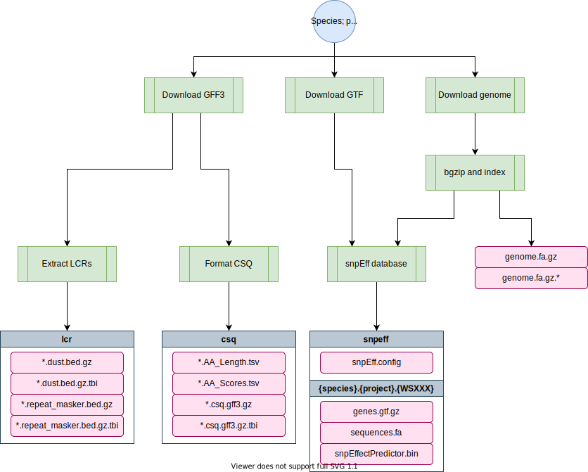

# genomes-nf

[TOC]

This repo contains a nextflow pipeline that downloads, indexes, and builds annotation databases for reference genomes from wormbase. The following outputs are created:

1. A BWA Index
2. SNPeff annotation database
3. CSQ annotation database
4. Samtools faidx index
5. A GATK Sequence dictionary file

!!! Important
	When adding a new WormBase version reference genome, *especially for c_elegans* it is essential that you use this pipeline instead of downloading and adding the files to QUEST manually. These files and this file structure are essential to many other pipelines in the lab.

# Pipeline overview

```

    >AAGACGACTAGAGGGGGCTATCGACTACGAAACTCGACTAGCTCAGCGGGATCAGCATCACGATGGGGGCCTATCTACGACAAAATCAGCTACGAAA
    AGACCATCTATCATAAAAAATATATATCTCTTTCTAGCGACGATAAACTCTCTTTCATAAATCTCGGGATCTAGCTATCGCTATATATATATATATGC
    GAAATA      CGCG       GA ATATA AAAA    TCG TCGAT GC       GGGC     CGATCGA TAGAT GA      TATATCGC
    TTAAC ACTAGAGGGG CTATCGAC  CGAA CT GACTA CT  GCG  AT AGCATCACG TGGGGGCCTATC  CGAC AA TCAGCTACGAAAT
    AGCCC TCTATCATAA    TATAT T TCT TC AGCGA GA A A T TC    ATAAAT TCGGGATCTAGC A CGC AT    ATATATATGC
    GCGAT TCTAC   AG GCGGGGGA AT TA AA AAGAC CG TC AT GC AGCTGGGGGC    ACG   GA TA AT GA CTATATATATCGC
    AATGC ACTAGAG GG CTATCGAC ACG A CT GACTA CT AGCGG AT AGCATCACGATGGG GCCTATC ACG C AA TCAGCTACGAAAT
    ACTCC TCTATCA AA AAATATAT TCTC  TC AGCGA GA AAACT TC TTCATAAATCTCGG ATCTAGC ATCG  AT TATATATATATGC
    TTAATA       FCG       GA ATATA AAA     TCG TCGAT GC        GG     ACGATCGA TAGAT GA CTATATATATCGC
    AACACGACTAGAGGGGGCTATCGACTACGAAACTCGACTAGCTCAGCGGGATCAGCATCACGATGGGGGCCTATCTACGACAAAATCAGCTACGAAAT
    CTACCATCTATCATAAAAAATATATATCTCTTTCTAGCGACGATAAACTCTCTTTCATAAATCTCGGGATCTAGCTATCGCTATATATATATATATGC


        parameters          description                                    Set/Default
        ==========          ===========                                    ========================
        --wb_version        wormbase version to build                      WS276
        --projects          comma-delimited list of `species/project_id`   c_elegans/PRJNA13758,c_briggsae/PRJNA10731,c_tropicalis/PRJNA53597
        --output            Path of output folder                          /projects/b1059/data/


```



## Software requirements

* Nextflow v20.01+ (see the dry guide on Nextflow [here](quest-nextflow.md) or the Nextflow documentation [here](https://www.nextflow.io/docs/latest/getstarted.html)). On QUEST, you can access this version by loading the `nf20` conda environment prior to running the pipeline command:

```
module load python/anaconda3.6
source activate /projects/b1059/software/conda_envs/nf20_env
```

* If running pipeline on Quest, you must first load `singularity` to access the docker container:

```
module load singularity
```

* If running locally, Docker must be installed. For further instructions, check out our [docker guide](pipeline-docker.md)

# Usage

The pipeline can be run locally or on Quest. For example:

```
nextflow run main.nf -resume -profile local --wb_version=WS276 --projects=c_elegans/PRJNA13758
```

# Parameters

### `-profile` (optional)

Can be set to `local` or `quest`. The pipeline uses the `andersenlab/genomes` docker image built from [`env/genome.Dockerfile`](env/genome.Dockerfile). The image is automatically built using github actions. See [`.github/workflows/build.yml`](.github/workflows/build.yml) for details.

!!! Note
	The default profile is set to `-profile=quest`

## Default usage: downloading genome files from Wormbase

This is how the pipeline is mostly run, especially for *C. elegans*.

### `--wb_version` (optional)

The wormbase version to build. For example, `WS279`. Default is `WS276`.

### `--projects` (optional)

A comma-delimited list of `species/project_id` identifiers. A table below lists the current projects that can be downloaded. This table is regenerated as the first step of the pipeline, and stored as a file called `project_species.tsv` in the `params.output` folder (`./genomes` if working locally).

By default, the pipeline will generate reference genome indices and annotations for:

* `c_elegans/PRJNA13758` - N2 based reference genome
* `c_briggsae/PRJNA10731`
* `c_tropicalis/PRJNA53597`

The current set of available species/projects that can be built are:

| species         | project     |
|:----------------|:------------|
| b_xylophilus    | PRJEA64437  |
| c_briggsae      | PRJNA10731  |
| c_angaria       | PRJNA51225  |
| a_ceylanicum    | PRJNA231479 |
| a_suum          | PRJNA62057  |
| a_suum          | PRJNA80881  |
| b_malayi        | PRJNA10729  |
| c_brenneri      | PRJNA20035  |
| c_elegans       | PRJEB28388  |
| c_elegans       | PRJNA13758  |
| c_elegans       | PRJNA275000 |
| c_latens        | PRJNA248912 |
| c_remanei       | PRJNA248909 |
| c_remanei       | PRJNA248911 |
| c_remanei       | PRJNA53967  |
| c_inopinata     | PRJDB5687   |
| c_japonica      | PRJNA12591  |
| c_sp11          | PRJNA53597  |
| c_sp5           | PRJNA194557 |
| c_nigoni        | PRJNA384657 |
| c_sinica        | PRJNA194557 |
| c_tropicalis    | PRJNA53597  |
| d_immitis       | PRJEB1797   |
| h_bacteriophora | PRJNA13977  |
| l_loa           | PRJNA60051  |
| m_hapla         | PRJNA29083  |
| m_incognita     | PRJEA28837  |
| h_contortus     | PRJEB506    |
| h_contortus     | PRJNA205202 |
| n_americanus    | PRJNA72135  |
| p_exspectatus   | PRJEB6009   |
| o_tipulae       | PRJEB15512  |
| p_redivivus     | PRJNA186477 |
| s_ratti         | PRJEA62033  |
| s_ratti         | PRJEB125    |
| o_volvulus      | PRJEB513    |
| p_pacificus     | PRJNA12644  |
| t_muris         | PRJEB126    |
| t_spiralis      | PRJNA12603  |
| t_suis          | PRJNA208415 |
| t_suis          | PRJNA208416 |

### `--output` (optional)

Path of output folder with results. Default is `/projects/b1059/data/{species}/genomes/{projectID}/{WSbuild}/`

---

## Alternative usage: using manually selected genomes 

This step is mostly for making the snpEff database and making sure that the gff is in the proper format for BCSQ annotation when you have a manually curated genome/gff file. This is common for *C. briggsae* and *C. tropicalis* and might start to be used if we want to annotate *C. elegans* wild isolates like CB4856.

## `--genome`

Path to manually curated genome (for genomes not downloaded from wormbase)

## `--gff`

Path to manually curated gff generated using the above genome (for genomes not downloaded from wormbase)

---

# Output

Outputs are nested under `params.output` with the following structure:

```
c_elegans                                                                   (species)
└── genomes
    └── PRJNA13758                                                          (project)
        └── WS276                                                           (build)
            ├── c_elegans.PRJNA13758.WS276.genome.dict                      (dict file)
            ├── c_elegans.PRJNA13758.WS276.genome.fa.gz                     (fasta)
            ├── c_elegans.PRJNA13758.WS276.genome.fa.gz.amb                 (bwa index)
            ├── c_elegans.PRJNA13758.WS276.genome.fa.gz.ann                 (bwa index)
            ├── c_elegans.PRJNA13758.WS276.genome.fa.gz.bwt                 (bwa index)
            ├── c_elegans.PRJNA13758.WS276.genome.fa.gz.fai                 (samtools faidx index)
            ├── c_elegans.PRJNA13758.WS276.genome.fa.gz.gzi                 (bwa index)
            ├── c_elegans.PRJNA13758.WS276.genome.fa.gz.pac                 (bwa index)
            ├── c_elegans.PRJNA13758.WS276.genome.fa.gz.sa                  (bwa index)
            ├── csq
            │   ├── c_elegans.PRJNA13758.WS276.csq.gff3.gz                  (CSQ annotation GFF3)
            │   ├── c_elegans.PRJNA13758.WS276.csq.gff3.gz.tbi              (tabix index)
            │   ├── c_elegans.PRJNA13758.WS276.AA_Length.tsv                (protein lengths)
            │   └── c_elegans.PRJNA13758.WS276.AA_Scores.tsv                (blosum and grantham scores)
            ├── lcr
            │   ├── c_elegans.PRJNA13758.WS276.repeat_masker.bed.gz         (low complexity regions)
            │   ├── c_elegans.PRJNA13758.WS276.repeat_masker.bed.gz.tbi     (tabix index)
            │   ├── c_elegans.PRJNA13758.WS276.dust.bed.gz                  (low complexity regions)
            │   └── c_elegans.PRJNA13758.WS276.dust.bed.gz.tbi              (tabix index)
            └── snpeff
                ├── c_elegans.PRJNA13758.WS276                              (tabix index)
                │   ├── genes.gtf.gz                                        (Reference GTF)
                │   ├── sequences.fa                                        (fasta genome (unzipped))
                │   └── snpEffectPredictor.bin                              (snpEff annotation db)
                └── snpEff.config                                           (snpEff configuration file)

```

## Notes

* The SNPeff databases are not collected together in one location as is often the case. Instead, they are stored individually with their own configuration files.
* The GFF3 files for some species are not as developed as _C. elegans_. As a consequence, the biotype is inferred from the Attributes column of the GFF. See `bin/format_csq.R` for more details.

!!! Warning
	The updated csq-formated gff script needs to be updated for other species besides *C. elegans* (if running the default mode)

