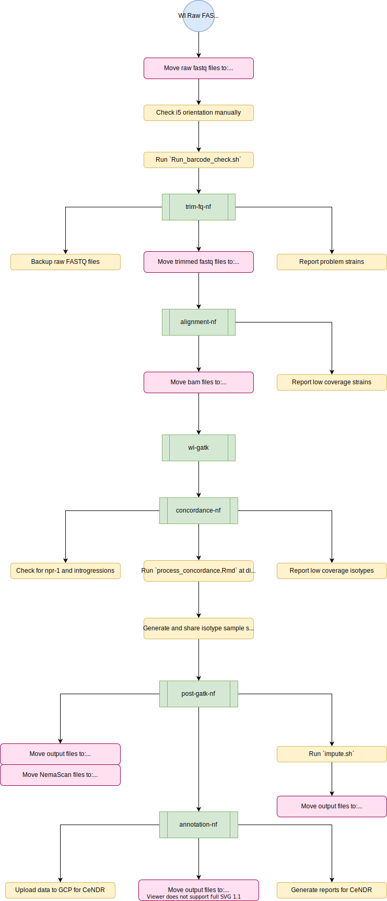

# Pipeline Overview

[TOC]

An overview of the sequencing pipelines is shown below. Wild isolate data are processed by multiple pipelines. NIL/RIL sequence data are only processed by one pipeline.

## Wild isolate sequencing

!!! Note
	The full protocol (in development) can be found [here](https://katiesevans9.notion.site/Wild-isolate-sequence-analysis-protocol-00e76cc7f55f4bf6ab644dd99c883727)

