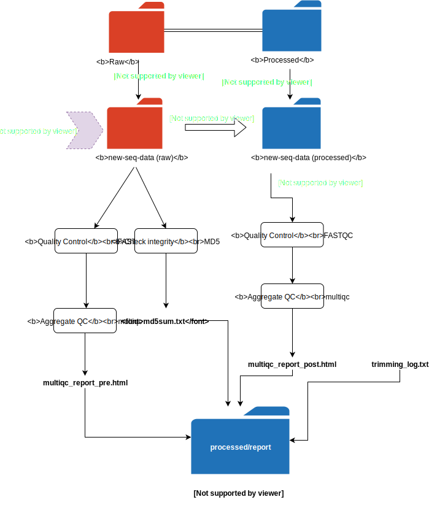

# trimmomatic-nf

The trimmomatic workflow performs trimming to remove poor quality sequences and technical sequences such as adapters. It should be used with high-coverage genomic DNA. You should not use the trimmomatic workflow on low-coverage NIL or RIL data.

[TOC]

# Usage

## Prerequisites

* You have downloaded FASTQ Data to a subdirectory within a raw directory. For wild isolates this will be `/projects/b1059/data/fastq/WI/dna/raw/<folder_name>`
* FASTQs __must__ end in a `.fq.gz` extension for the pipeline to work..
* You have modified FASTQ names if necessary to add strain names or other identifying information.
* You have installed software-requirements, preferably using the `andersen-lab-env`. You can learn how to install the environment [here](quest-setup).

__Software requirements__

* trimmomatic
* fastqc
* multiqc

!!! note
    All FASTQs should end with a `_1.fq.gz` or a `_2.fq.gz`. You can rename FASTQs using the rename command:

    ```
    rename --dry-run --subst .fastq.gz .fq.gz --subst _R1_001 _1 --subst _R2_001 _2 *.fastq.gz
    ```

    The `--dry-run` flag will output how files will be renamed. Review the output and remove
    the flag when you are ready. 
  

## Running the pipeline

First you will need to `cd` to the directory containing the raw FASTQs. This directory will be downloaded into a `raw` parent directory.
When you run the pipeline it will create a sequence directory of the same name in an existing or newly created `processed` directory and dump FASTQs there.

Unlike all other pipelines, the `trimmomatic-nf` pipeline is run directly from the git repo

```bash
nextflow run andersenlab/trimmomatic-nf -latest --email <your email address>
```

!!! note

    The pipeline is designed to not be destructive. Trimming creates from the `raw` parent directory to the processed parent directory as
    shown below.

    `/projects/b1059/data/fastq/WI/dna/raw/<seq_folder>/S_1.fq.gz` 

    __-- trimming -->__

    `/projects/b1059/data/fastq/WI/dna/processed/<folder_name>/S_1P.fq.gz`

### Parameters

* __--email__ - Specify an email address to be notified when the pipeline succeeds or fails.

# Overview



### Output

The resulting trimmed FASTQs will be output in the `processed` directory located up one level from the current directory. For example:

__FASTQs are originally deposited in this directory__

`/projects/b1059/data/fastq/WI/dna/raw/new_wi_seq`

__You run the pipeline while sitting in the same directory:__

`/projects/b1059/data/fastq/WI/dna/raw/new_wi_seq`

__And results are output in the following directory:__

`/projects/b1059/data/fastq/WI/dna/processed/new_wi_seq`

__Report output__

The `trimmomatic-nf` pipeline outputs four files, all of which are located in the __processed__ directory. Continuing with the example above, report files will be located here:

`/projects/b1059/data/fastq/WI/dna/processed/new_wi_seq/report`

The report output files are:

* __md5sum.txt__ - md5 hashes of all the untrimmed FASTQs. These can be used to verify the integrity of the files.
* __trimming_log.txt__ - A summary of the pipeline-run and software environment.
* __multiqc_report_pre.html__ - Aggregated FASTQC report before trimming.
* __multiqc_report_post.html__ - Aggregated FASTQC report after trimming.

Additionally, the `raw/seq` and `processed/seq` will have `fastq/` folders containing the original, unaggregatred FASTQC reports.

### Cleanup

If you have triple-checked everything and are satisfied with the results, the original, raw sequence data can be deleted.

### Backup

Once you have completed the trimmomatic-nf pipeline you should backup the FASTQs. More information on this is available in the [backup](backup.md)
