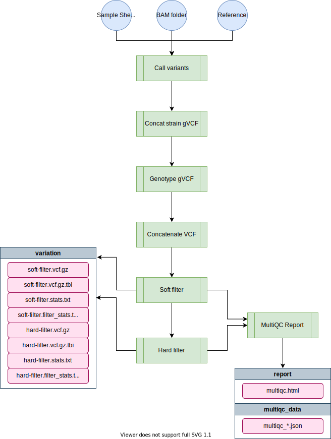

# wi-gatk

[TOC]

The `wi-gatk` pipeline filters and calls variants from wild isolate sequence data.


# Pipeline Overview

```

    _______ _______ _______ __  __      _______ _______ 
    |     __|   _   |_     _|  |/  |    |    |  |    ___|
    |    |  |       | |   | |     <     |       |    ___|
    |_______|___|___| |___| |__|\\__|    |__|____|___|    
                                              

    parameters                 description                           Set/Default
    ==========                 ===========                           ========================
    --debug                    Use --debug to indicate debug mode    null
    --output                   Release Directory                     WI-{date}
    --sample_sheet             Sample sheet                          null
    --bam_location             Directory of bam files                /projects/b1059/data/{species}/WI/alignments/
    --mito_name                Contig not to polarize hetero sites   MtDNA

    Reference Genome
    --------------- 
    --reference_base           Location of ref genomes               /projects/b1059/data/{species}/genomes/
    --species/project/build    These 4 params form --reference       {species} / {project} / {ws_build}

    Variant Filters         
    ---------------           
    --min_depth                Minimum variant depth                 5
    --qual                     Variant QUAL score                    30
    --strand_odds_ratio        SOR_strand_odds_ratio                 5
    --quality_by_depth         QD_quality_by_depth                   20
    --fisherstrand             FS_fisher_strand                      100
    --high_missing             Max % missing genotypes               0.95
    --high_heterozygosity      Max % max heterozygosity              0.10


```



## Software Requirements

* The latest update requires Nextflow version 20.0+. On QUEST, you can access this version by loading the `nf20` conda environment prior to running the pipeline command:

```
module load python/anaconda3.6
source activate /projects/b1059/software/conda_envs/nf20_env
```

Alternatively you can update Nextflow by running:

```
nextflow self-update
```

### Relevant Docker Images

* `andersenlab/gatk4` ([link](https://hub.docker.com/r/andersenlab/gatk4)): Docker image is created within this pipeline using GitHub actions. Whenever a change is made to `env/gatk4.Dockerfile` or `.github/workflows/build_docker.yml` GitHub actions will create a new docker image and push if successful
* `andersenlab/r_packages` ([link](https://hub.docker.com/r/andersenlab/r_packages)): Docker image is created manually, code can be found in the [dockerfile](https://github.com/AndersenLab/dockerfile/tree/master/r_packages) repo.

To access these docker images, first load the `singularity` module on QUEST.

```
module load singularity
```

Also, make sure that you add the following code to your `~/.bash_profile`. This line makes sure that any singularity images you download will go to a shared location on `b1059` for other users to take advantage of (without them also having to download the same image).

```
# add singularity cache
export SINGULARITY_CACHEDIR='/projects/b1059/singularity/'
```

# Usage

*Note: if you are having issues running Nextflow or need reminders, check out the [Nextflow](quest-nextflow.md) page.*


## Profiles

The `nextflow.config` file included with this pipeline contains three profiles. These set up the environment for testing local development, testing on Quest, and running the pipeline on Quest.

* `local` - Used for local development. Uses the docker container.
* `debug` - Runs a small subset of available test data. Should complete within a couple of minutes. For testing/diagnosing issues on Quest.
* `quest` - Runs the entire dataset.

!!! Note
    If you forget to add a `-profile`, the `quest` profile will be chosen as default

## Running the pipeline locally

When running locally, the pipeline will run using the `andersenlab/gatk4` docker image. You must have docker installed.

```
nextflow run andersenlab/wi-gatk -profile local -resume
```

## Debugging the pipeline on Quest

When running on Quest, you should first run the quest debug profile. The Quest debug profile will use a test dataset and sample sheet which runs much faster and will encounter errors much sooner should they need to be fixed. If the debug dataset runs to completion it is likely that the full dataset will as well.

```
nextflow run andersenlab/wi-gatk -profile debug -resume
```

## Running the pipeline on Quest

The pipeline can be run on Quest using the following command:

```
nextflow run andersenlab/wi-gatk -profile quest --sample_sheet <path_to_sheet>
```

# Parameters

Most configuration is handled using the `-profile` flag and `nextflow.config`; If you want to fine tune things you can use the options below.

## --sample_sheet

The sample sheet is automatically generated from `alignment-nf`. The sample sheet contains 5 columns as detailed below:

| strain   | bam   | bai   | coverage  | percent_mapped   | 
|:----|:-------|:------|:-----------|:-------------|
| AB1 | AB1.bam  | AB1.bam.bai  | 64  | 99.4 | 
| AB4 | AB4.bam  | AB4.bam.bai  | 52  | 99.2 | 
| BRC20067 | BRC20067.bam  | BRC20067.bam.bai  | 30  | 92.5 | 

!!! Important
    It is essential that you always use the pipelines and scripts to generate this sample sheet and **NEVER** manually. There are lots of strains and we want to make sure the entire process can be reproduced.

!!! Note
    The sample sheet produced from `alignment-nf` is only for strains that you ran in the alignment pipeline most recently. If you want to combine old strains with new strains, you will have to combine two or more sample sheets. **If you are running a species-wide analysis for CeNDR, please follow the notes in the full WI protocol [here](https://katiesevans9.notion.site/Wild-isolate-sequence-analysis-protocol-00e76cc7f55f4bf6ab644dd99c883727)**

### --bam_location (optional)

Path to directory holding all the alignment files for strains in the analysis. Defaults to `/projects/b1059/data/{species}/WI/alignments/`

!!! Important
    Remember to move your bam files output from [alignment-nf](github.com/andersenlab/alignment-nf) to this location prior to running `wi-gatk`. In **most** cases, you will want to run `wi-gatk` on all samples, new and old combined.

### --species (optional)

__default__ = c_elegans

Options: c_elegans, c_briggsae, or c_tropicalis

### --project (optional)

__default__ = PRJNA13758

WormBase project ID for selected species. Choose from some examples [here](https://github.com/AndersenLab/genomes-nf/blob/master/bin/project_species.tsv)

### --ws_build (optional)

__default__ = WS283

WormBase version to use for reference genome.

### --reference (optional)

A fasta reference indexed with BWA. On Quest, the reference is available here:

```
/projects/b1059/data/c_elegans/genomes/PRJNA13758/WS283/c_elegans.PRJNA13758.WS283.genome.fa.gz
```

!!! Note
    If running on QUEST, instead of changing the `reference` parameter, opt to change the `species`, `project`, and `ws_build` for other species like c_briggsae (and then the reference will change automatically) 

### --mito_name (optional)

Name of contig to skip het polarization. Might need to change for other species besides c_elegans if the mitochondria contig is named differently. Defaults to `MtDNA`.

### --output (optional)

A directory in which to output results. By default it will be `WI-YYYYMMDD` where YYYYMMDD is todays date.


# Output

The final output directory looks like this:

```

├── variation
│   ├── *.hard-filter.vcf.gz
│   ├── *.hard-filter.vcf.tbi
│   ├── *.hard-filter.stats.txt
│   ├── *.hard-filter.filter_stats.txt
│   ├── *.soft-filter.vcf.gz
│   ├── *.soft-filter.vcf.tbi
│   ├── *.soft-filter.stats.txt
│   └── *.soft-filter.filter_stats.txt
└── report
    ├── multiqc.html
    └── multiqc_data
        └── multiqc_*.json
   
```

# Data Storage

## Cleanup

The `hard-filter.vcf` is the input for both the [`concordance-nf`](https://github.com/AndersenLab/concordance-nf) pipeline and the [`post-gatk-nf`](https://github.com/AndersenLab/post-gatk-nf) pipeline. Once both pipelines have been completed successfully, the hard and soft filter vcf and index files (everything output in the `variation` folder) can be moved to `/projects/b1059/data/{species}/WI/variation/{date}/vcf`.


