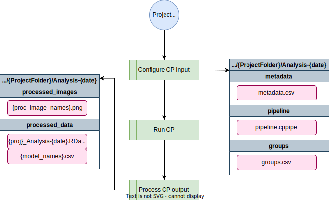

# Andersen Lab Image Analysis Pipeline
## Implemented using CellProfiler

[TOC]

The [cellprofiler-nf](https://github.com/AndersenLab/cellprofiler-nf) pipeline performs worm position and stage identification using CellProfiler and process the output.


# A Pipeline overview

C E L L P R O F I L E R - N F   P I P E L I N E

	parameters              description                                 Set/Default
	==========              ===========                                 ========================
    --project               The path to your project directory          Required
    --pipeline              The CP pipeline to use: toxin, dauer        Required
    --groups                Comma separated metadata groupings          "plate,well"
    --outdir                Output directory to place files             "{projectdir}/Analysis-{date}"
    --help                  This usage statement



## Software requirements

* Nextflow v23+ (see the dry guide on Nextflow [here](../rockfish/rf-nextflow.md) or the Nextflow documentation [here](https://www.nextflow.io/docs/latest/getstarted.html)). On Rockfish, you can access this version by loading the `nf23_env` conda environment prior to running the pipeline command:

```
module load python/anaconda
source activate /data/eande106/software/conda_envs/nf23_env
```

## Relevant Docker Images

*Note: Before 20220301, this pipeline was run using existing conda environments on QUEST. However, these have since been migrated to docker imgaes to allow for better control and reproducibility across platforms. If you need to access the conda version, you can always run an old commit with `nextflow run andersenlab/cellprofiler-nf -r 20220216-Release`*

* `cellprofiler/cellprofiler` ([link](https://hub.docker.com/r/cellprofiler/cellprofiler)): Docker image is maintained by the Broad Institute of MIT and Harvard
* `andersenlab/r_packages` ([link](https://hub.docker.com/r/andersenlab/r_packages)): Docker image is created manually, code can be found in the [dockerfile](https://github.com/AndersenLab/dockerfile/tree/master/r_packages) repo.

Make sure that you add the following code to your `~/.bash_profile`. This line makes sure that any singularity images you download will go to a shared location on `/vast/eande106` for other users to take advantage of (without them also having to download the same image).

```
# add singularity cache
export SINGULARITY_CACHEDIR='/vast/eande106/singularity/'
```

!!! Note
	If you need to work with the docker container, you will need to create an interactive session as singularity can't be run on Rockfish login nodes.
	
	```
	interact -n1 -pexpress
	module load singularity
	singularity shell [--bind local_dir:container_dir] /vast/eande106/singularity/<image_name>
	```

# Usage

*Note: if you are having issues running Nextflow or need reminders, check out the [Nextflow](../rockfish/rf-nextflow.md) page.*

## Testing on Rockfish

*This command uses a test dataset*

```
nextflow run -latest andersenlab/cellprofiler-nf --debug
```

## Running on Rockfish

You should run this in a screen or tmux session.

```
nextflow run -latest andersenlab/cellprofiler --pipeline dauer --project /vast/eande106/project/<user>/<project_dir>
```

# Parameters

##  --project

The path to your project directory which must contain a directory named "raw_images" containing your images to analyze

## --pipeline

The CP pipeline to use: toxin or dauer

## --groups

Comma separated metadata groupings (default: "plate,well")

## --outdir

Directory to store results in. (default: <project_dir>/Analysis-{date})

# CellProfiler Repository Data Directory Structure (`input_data/` With Example Files)

```bash
input_data
  ├── batch_files
  |   └── 20191119_example_batch_20201018.h5
  ├── metadata
  |   └── 20191119_example_metadata_20201018.csv
  ├── pipelines
  |   ├── 20191119_example.cpproj
  |   └── sample_pipelines
  ├── projects
  |   └── 20191119_example
  |       ├── raw_images
  |       └── output_data
  |           └── 20191119_example_data_1603047856
  |               ├── CellProfiler-Analysis_20191119_example_data_1603047856run1
  |               ├── Logs
  |               ├── ProcessedImages
  |               ├── OverlappingWorms_Data
  |               └── NonOverlappingWorms_Data
  ├── scripts
  |   ├── generate_metadata.R
  |   ├── run_cellprofiler.sh
  |   ├── cellprofiler_parallel.sh
  |   ├── check_run_cellprofiler.sh
  |   └── aggregate_cellprofiler_results.R
  ├── well_masks
  |   └── wellmask_98.png
  └── worm_models
      ├── Adult_N2_HB101_100w.xml
      ├── L1_N2_HB101_100w.xml
      ├── L2L3_N2_HB101_100w.xml
      ├── L4_N2_HB101_100w.xml
      ├── WM_FBZ_control.xml
      ├── WM_FBZ_dose.xml
      └── high_dose_worm_model.xml
```

# Input Directory Structure
## dauer input

```bash
<project folder name>/
  └── raw_images
      ├── 20191119-project-p01-m2x_A01_w1.tif
      ├── 20191119-project-p01-m2x_A02_w1.tif
      └── ...
```

## toxin input

```bash
<project folder name>/
  └── raw_images
      ├── 20191119-project-p01-m2x_A01.tif
      ├── 20191119-project-p01-m2x_A02.tif
      └── ...
```

# Output Directory Structure

## dauer output
```bash
<project folder name>/
├── raw_images
└── Analysis-{current date}
    ├── pipeline
    ├── metadata
    ├── groups
    ├── processed_data
    |   └── 20220501_dauerDebug_Analysis-{current date}.RData
    └── processed_images
        ├── 20220501_dauerDebug-p002-m2X_A01_w1_overlay.png
        ├── 20220501_dauerDebug-p002-m2X_A01_w1_dauerMod_straightened_RFP.png
        ├── 20220501_dauerDebug-p002-m2X_A01_w1_nondauerMod_straightened_RFP.png
        ├── 20220501_dauerDebug-p002-m2X_A01_w2_dauerMod_NonOverlappingWorms_RFP_mask.png
        ├── 20220501_dauerDebug-p002-m2X_A01_w2_nondauerMod_NonOverlappingWorms_RFP_mask.png
        └── ...
```

## toxin output
```bash
<project folder name>/
├── raw_images
└── Analysis-{current date}
    ├── pipeline
    ├── metadata
    ├── groups
    ├── processed_data
    |   └── 20220501_toxinDebug_Analysis-{current date}.RData
    └── processed_images
        ├── 20220501_dauerDebug-p002-m2X_A01_w1_overlay.png
        └── ...
```

These data can be analyzed using the [R/easyXpress](https://github.com/AndersenLab/easyXpress) package 
