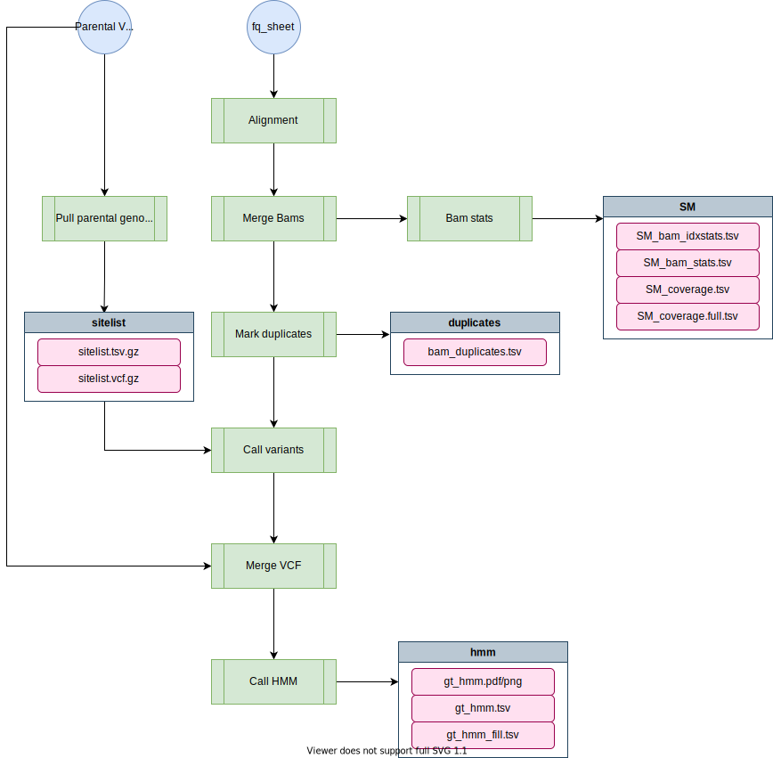

# nil-ril-nf

[TOC]

The `nil-ril-nf` pipeline will align, call variants, and generate datasets for NIL and RIL sequence data. It runs a hidden-markov-model to fill in missing genotypes from low-coverage sequence data.

# Overview

```bash

	███╗   ██╗██╗██╗      ██████╗ ██╗██╗      ███╗   ██╗███████╗
	████╗  ██║██║██║      ██╔══██╗██║██║      ████╗  ██║██╔════╝
	██╔██╗ ██║██║██║█████╗██████╔╝██║██║█████╗██╔██╗ ██║█████╗
	██║╚██╗██║██║██║╚════╝██╔══██╗██║██║╚════╝██║╚██╗██║██╔══╝
	██║ ╚████║██║███████╗ ██║  ██║██║███████╗ ██║ ╚████║██║
	╚═╝  ╚═══╝╚═╝╚══════╝ ╚═╝  ╚═╝╚═╝╚══════╝ ╚═╝  ╚═══╝╚═╝


	parameters           description                    Set/Default
	==========           ===========                    =======

	--debug              Set to 'true' to test          false
	--cores              Number of cores                4
	--A                  Parent A                       N2
	--B                  Parent B                       CB4856
	--cA                 Parent A color (for plots)     #0080FF
	--cB                 Parent B color (for plots)     #FF8000
	--out                Directory to output results    NIL-N2-CB4856-2017-09-27
	--fqs                fastq file (see help)          (required)
	--relative           use relative fastq prefix      true
	--reference          Reference Genome               (required)
	--vcf                VCF to fetch parents from      (required)
	--tmpdir             A temporary directory          tmp/


	The Set/Default column shows what the value is currently set to
	or would be set to if it is not specified (its default).


```



1. `Alignment` - Performed using bwa-mem
1. `Merge Bams` - Combines bam files aligned individually for each fastq-pair. [Sambamba](http://lomereiter.github.io/sambamba/) is actually used in place of samtools, but it's a drop-in, faster replacement.
1. `Bam Stats` - A variety of metrics are calculated for bams and combined into individual files for downstream analsyis.
1. `Mark Duplicates` - Duplicate reads are marked using Picard.
1. `Call Variants individual` - Variants are called for each strain inidividually first. This generates a sitelist which is used to identify all variant sites in the population.
1. `Pull parental genotypes` - Pulls out parental genotypes from the given VCF. The list of genotypes is filtered for discordant calls (i.e. different genotypes). This is VCF is used to generate a sitelist for calling low-coverage bams and later is merged into the resulting VCF.
1. `Call variants union` - Uses the sitelist from the previous step to call variants on low-coverage sequence data. The resulting VCF will have a lot of missing calls.
1. `Merge VCF` - Merges in the parental VCF (which has been filtered only for variants with discordant calls).
1. `Call HMM` - VCF-kit is run in various ways to infer the appropriate genotypes from the low-coverage sequence data.

!!! Important
	Do not perform any pre-processing on NIL data. NIL-data is low-coverage by design and you want to retain as much sequence data (however poor) as possible.

## Software Requirements

* The latest update requires Nextflow version 23+. On Rockfish, you can access this version by loading the `nf23_env` conda environment prior to running the pipeline command:

```
module load python/anaconda
source activate /data/eande106/software/conda_envs/nf23_env
```

### Relevant Docker Images

The docker image used by the `nil-ril-nf` pipeline is the `nil-ril-nf` docker image:

[andersenlab/nil-ril-nf](https://hub.docker.com/r/andersenlab/nil-ril-nf/)

The __Dockerfile__ is stored in the root of the `nil-ril-nf` github repo and is automatically built on [Dockerhub](http://www.dockerhub.com) whenever the repo is pushed.

# Usage

*Note: if you are having issues running Nextflow or need reminders, check out the [Nextflow](../rockfish/rf-nextflow.md) page.*

## Testing on Rockfish

*This command uses a test dataset*

```
nextflow run -latest andersenlab/nil-ril-nf --debug
```

## Running on Rockfish

You should run this in a screen or tmux session.

```
nextflow run -latest andersenlab/nil-ril-nf -resume
```

## Running the pipeline locally

When running locally, the pipeline will run using the `andersenlab/nil-ril-nf` docker image. You must have docker installed. You will need to obtain a reference genome to run the alignment with as well. You can use the following command to obtain the reference:

```
curl ftp://wormbase.org/pub/wormbase/releases/WS276/species/c_elegans/PRJNA13758/c_elegans.PRJNA13758.WS276.genomc.fa.gz > WS276.fa.gz
```

Run the pipeline locally with:
```bash
nextflow run -latest andersenlab/nil-ril-nf -profile local -resume
```

# Parameters

## -profile

There are three configuration profiles for this pipeline.

* `rockfish` - Used for running on Rockfish (default).
* `quest`    - Used for running on Quest.
* `local`    - Used for local development.

!!! Note
	If you forget to add a `-profile`, the `rockfish` profile will be chosen as default

## --debug

You should use `--debug` for testing/debugging purposes. This will run the debug test set (located in the `test_data` folder).

For example:

```
nextflow run -latest andersenlab/nil-ril-nf --debug
```

## --fqs

In order to process NIL/RIL data, you need to move the sequence data to a folder and create a `fq_sheet.tsv`. This file defines the fastqs that should be processed. The fastq can be specified as *relative* or *absolute*. By default, they are expected to be relative to the fastq file. The FASTQ sheet details strain names, ids, library, and files. It should be tab-delimited and look like this:

```
NIL_01   NIL_01_ID    S16 NIL_01_1.fq.gz   NIL_01_2.fq.gz
NIL_02   NIL_02_ID    S1  NIL_02_1.fq.gz   NIL_02_2.fq.gz
```

Notice that the file does not include a header. The table with corresponding columns looks like this.

| strain   | fastq_pair_id   | library   | fastq-1-path   | fastq-2-path   |
|:-------|:-----------------------|:------------------|:-------------------------------------------------------------------------------------------------------------------------|:-------------------------------------------------------------------------------------------------------------------------|
| NIL_01 | NIL_01_ID | S16 | NIL_01_1.fq.gz | NIL_01_2.fq.gz |
| NIL_02 | NIL_02_ID | S1  | NIL_02_1.fq.gz | NIL_02_2.fq.gz |

The columns are detailed below:

* __strain__ - The name of the strain. If a strain was sequenced multiple times this file is used to identify that fact and merge those fastq-pairs together following alignment.
* __fastq_pair_id__ - This must be unique identifier for all individual FASTQ pairs.
* __library__ - A string identifying the DNA library. If you sequenced a strain from different library preps it can be beneficial when calling variants. The string can be arbitrary (e.g. LIB1) as well if only one library prep was used.
* __fastq-1-path__ - The __relative__ path of the first fastq.
* __fastq-2-path__ - The __relative__ path of the second fastq.

This file needs to be placed along with the sequence data into a folder. The tree will look like this:

```bash
NIL_SEQ_DATA/
├── NIL_01_1.fq.gz
├── NIL_01_2.fq.gz
├── NIL_02_1.fq.gz
├── NIL_02_2.fq.gz
└── fq_sheet.tsv
```

Set `--fqs` as `--fqs=/the/path/to/fq_sheet.tsv`.

!!! Important
	Do not include the parental strains in the fq_sheet. If you re-sequenced the parent strains and want to include them in the analysis as a control, you need to rename the parent strains to avoid an error in merging the VCFs (i.e. N2 becomes N2-1).

## --vcf

Before you begin, you will need access to a VCF with high-coverage data from the parental strains. In general, this can be obtained using the latest release of the wild-isolate data which is usually located in the `/vast/eande106/data` analysis folder (on Rockfish). For example, the most recent _C. elegans_ VCF could be found here:

```
/vast/eande106/data/c_elegans/WI/variation/20210121/vcf/WI.20210121.hard-filter.isotype.vcf.gz
```

This is the __hard-filtered__ VCF, meaning that poor quality variants have been stripped. Use hard-filtered VCFs for this pipeline.

Set the parental VCF as `--vcf=/the/path/to/WI.20210121.hard-filter.isotype.vcf.gz`

## --reference

A fasta reference indexed with BWA. For example, the _C. elegans_ reference could be found here:

```
/vast/eande106/data/c_elegans/genomes/PRJNA13758/WS276/c_elegans.PRJNA13758.WS276.genome.fa.gz
```

## --A, --B (optional)

Two parental strains must be provided. By default these are N2 and CB4856. The parental strains provided __must__ be present in the VCF provided. Their genotypes are pulled from that VCF and used to generate the HMM. See below for more details.

## --cores (optional)

The number of cores to use during alignments and variant calling. Default is 4.

## --cA, --cB (optional)

The color to use for parental strain A and B on plots. Default is orange and blue.

## --out (optional)

A directory in which to output results. By default it will be `NIL-A-B-YYYY-MM-DD` where A and be are the parental strains.

## --relative (optional)

If you want to specify fastqs using an absolute path use `--relative=false`. Set to `true` by default. 

## --cross_obj (optional)

If you are running a set of RILs, you might want to add the `--cross_obj true` parameter. When `true`, the pipeline will run an additional step to pair down the total genetic variants to only the informative variants and output a smaller genotype matrix to input directly into a new cross object. An example of how to generate a cross object can be found in the `bin`. There is no need to run this option for NIL data.

## --tmpdir (optional)

A directory for storing temporary data.

# Output

The final output directory looks like this:

```bash
.
├── log.txt
├── fq
│   ├── fq_bam_idxstats.tsv
│   ├── fq_bam_stats.tsv
│   ├── fq_coverage.full.tsv
│   └── fq_coverage.tsv
├── SM
│   ├── SM_bam_idxstats.tsv
│   ├── SM_bam_stats.tsv
│   ├── SM_coverage.full.tsv
│   ├── SM_union_vcfs.txt
│   └── SM_coverage.tsv
├── hmm
│   ├── gt_hmm.(png/svg)
│   ├── gt_hmm.tsv
│   ├── gt_hmm_fill.tsv
│   ├── NIL.filtered.stats.txt
│   ├── NIL.filtered.vcf.gz
│   ├── NIL.filtered.vcf.gz.csi
│   ├── NIL.hmm.vcf.gz
│   ├── NIL.hmm.vcf.gz.csi
│   └── gt_hmm_genotypes.tsv
├── bam
│   └── <BAMS + indices>
├── duplicates
│   └── bam_duplicates.tsv
└─ sitelist
    ├── N2.CB4856.sitelist.[tsv/vcf].gz
    └── N2.CB4856.sitelist.[tsv/vcf].gz.[tbi/csi]
```

### log.txt

A summary of the nextflow run.

### duplicates/

__bam_duplicates.tsv__ - A summary of duplicate reads from aligned bams.

### fq/

* __fq_bam_idxstats.tsv__ - A summary of mapped and unmapped reads by fastq pair.
* __fq_bam_stats.tsv__ - BAM summary by fastq pair.
* __fq_coverage.full.tsv__ - Coverage summary by chromosome
* __fq_coverage.tsv__ - Simple coverage file by fastq

### SM/

If you have multiple fastq pairs per sample, their alignments will be combined into a strain or sample-level BAM and the results will be output to this directory.

* __SM_bam_idxstats.tsv__ - A summary of mapped and unmapped reads by sample.
* __SM_bam_stats.tsv__ - BAM summary at the sample level
* __SM_coverage.full.tsv__ - Coverage at the sample level
* __SM_coverage.tsv__ - Simple coverage at the sample level.
* __SM_union_vcfs.txt__ - A list of VCFs that were merged to generate RIL.filter.vcf.gz


### hmm/

!!! Important
	__gt_hmm_fill.tsv__ is for visualization purposes only. To determine breakpoints you should use __gt_hmm.tsv__.


The `--infill` and `--endfill` options are applied to the __gt_hmm_fill.tsv__ file. You need to be cautious when examining this data as it is __generated primarily for visualization purposes__.

* __gt_hmm.(png/svg)__ - Haplotype plot __using__ `--infill` and `--endfill`.
* __gt_hmm_fill.tsv__ - Same as above, but using `--infill` and `--endfill` with VCF-Kit. For more information, see [VCF-Kit Documentation](http://vcf-kit.readthedocs.io/en/latest/). This file is used to generate the plots.
* __gt_hmm.tsv__ - Haplotypes defined by region with associated information. Does __not__ use `--infill` and `--endfill`
* __gt_hmm_genotypes.tsv__ - Long form genotypes file.
* __NIL/RIL.filtered.vcf.gz__ - A VCF genotypes including the NILs and parental genotypes.
* __NIL/RIL.filtered.stats.txt__ - Summary of filtered genotypes. Generated by `bcftools stats NIL.filtered.vcf.gz`
* __NIL/RIL.hmm.vcf.gz__ - The NIL/RIL VCF as output by VCF-Kit; HMM applied to determine genotypes.


### plots/

* __coverage_comparison.png__ - Compares FASTQ and Sample-level coverage. Note that coverage is not simply cumulative. Only uniquely mapped reads count towards coverage, so it is possible that the sample-level coverage will not equal to the cumulative sum of the coverages of individual FASTQ pairs.
* __duplicates.(png/pdf)__ - Coverage vs. percent duplicated.
* __unmapped_reads.png__ - Coverage vs. unmapped read percent.

### sitelist/

* `<A>.<B>.sitelist.tsv.gz[+.tbi]` - A tabix-indexed list of sites found to be different between both parental strains.
* `<A>.<B>.sitelist.vcf.gz[+.tbi]` - A vcf of sites found to be different between both parental strains.

# Organizing final data

After the run is complete and you are satisfied with the results, follow these steps to ensure correct data storage on QUEST:

1. Move the raw fastq files to `/vast/eande106/data/{species}/{NIL or RIL}/fastq/`. You might want to use `mv -i` to ensure no files are overwritten.
2. Move the BAM files from the output folder to `/vast/eande106/data/{species}/{NIL or RIL}/alignments/`. You might want to use `mv -i` to ensure no files are overwritten.
3. Delete the now empty `bam` folder in the output directory.
4. Move the sample sheet generated for analysis into the output directory.
5. Make sure the output directory follows the default naming structure that is informative about the analysis (i.e. `NIL-20200322-N2-CB4856` (if NIL/RIL analysis is performed for another lab, consider adding a `-{LabName}` like `-Baugh` to the end of the folder name)).
6. Move the entire output folder to `/vast/eande106/data/{species}/{NIL or RIL}/variation`.

# Adding NIL sequence data to lab website

If your sequencing was N2-CB4856 NILs (and maybe other *C. elegans* NILs as well...?) you probably want to add this sequencing data to the lab website to be accessed by everyone when looking for NIL genotypes.

Check out [this page](adding-seq-data.md) for instructions on how to do that. Once done, you should be able to view your NILs on the [NIL browser shiny app](https://andersen-lab.shinyapps.io/nil-browser/).

