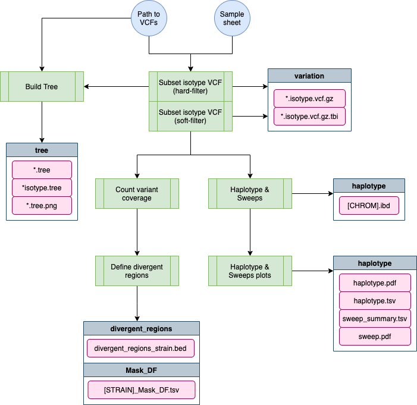

# post-gatk-nf


The [post-gatk-nf](https://github.com/AndersenLab/post-gatk-nf) pipeline performs two main tasks: (1) variant annotation for the VCF at the isotype level and (2) population genetics analyses (such as identifying shared haplotypes and divergent regions) at the isotype level. The VCFs output from this pipeline are used within the lab and also released to the world via CeNDR.

This page details how to run the pipeline.

[TOC]

# Pipeline overview
```


      * * * *                    **           * * * *    * * *    * * * *    *   *                         *
     *       *                * * * * *     *        *  *     *      *       *  *                         * *
    *        *                   **         *           *     *      *       * *                         * *
   *        *   * * * * * *      **    ***  *           * * * *      *       * *      ***      *          *
  * * * * *    *   * *   * *     **         *    * * *  *     *      *       *  *             * * *      *
 *            *     *   *   *   *  *        *        *  *     *      *       *   *           *     *    *   *
*              * * *   * * * * *    *        * * * * *  *     *      *       *    *         *      * * * * *  
                                                                                                      **
                                                                                                     * * 
                                                                                                    *  *
                                                                                                   *  *
                                                                                                    *
                         
    parameters              description                                            Set/Default
    ==========              ===========                                            ========================
    --debug                 Use --debug to indicate debug mode                     (optional)
    --vcf                   Hard filtered vcf to calculate variant density         (required)
    --sample_sheet          TSV with column iso-ref strain, bam, bai (no header)   (required)
    --species               Species: 'c_elegans', 'c_tropicalis' or 'c_briggsae'   c_elegans
    --project               Project name for species reference                     PRJNA13758
    --ws_build              WormBase version for species reference                 WS276
    --output                Output folder name.                                    popgen-date (in current folder)


```

<small>The logo above looks better in your terminal!</small>



## Software Requirements

* The latest update requires Nextflow version 20.0+. On QUEST, you can access this version by loading the `nf20` conda environment prior to running the pipeline command:

```
module load python/anaconda3.6
source activate /projects/b1059/software/conda_envs/nf20_env
```

Alternatively you can update Nextflow by running:

```
nextflow self-update
```

!!! Important
    This pipeline currently only supports analysis on Quest, cannot be run locally


# Usage

## Testing on Quest

*This command uses a test dataset*

```
nextflow run main.nf --debug
```

## Running on Quest

You should run this in a screen session.

```
nextflow run main.nf --vcf <path_to_vcf> --sample_sheet <path_to_sample_sheet>
```

# Parameters

## --debug

You should use `--debug true` for testing/debugging purposes. This will run the debug test set (located in the `test_data` folder).

For example:

```
nextflow run main.nf --debug -resume
```

Using `--debug` will automatically set the sample sheet to `test_data/sample_sheet.tsv`

## --sample_sheet

A custom sample sheet can be specified using `--sample_sheet`. The `sample sheet` is generated from the sample sheet used as input for [`wi-gatk-nf`](https://github.com/AndersenLab/wi-gatk) with only columns for strain, bam, and bai subsetted. Make sure to remove any strains that you do not want to include in this analysis.

Remember that in `--debug` mode the pipeline will use the sample sheet located in `test_data/sample_sheet.tsv`.

!!! Important
    There is no header for the sample sheet!

The `sample sheet` has the following columns:

* __strain__ - the name of the strain
* __bam__ - name of the bam alignment file
* __bai__ - name of the bam alignment index file

!!! Note
    As of 20210501, bam and bam.bai files for all strains of a particular species can be found in one singular location: `/projects/b1059/data/{species}/WI/alignments/` so there is no longer need to provide the location of the bam files.


## --vcf

Path to the hard-filtered vcf output from [`wi-gatk-nf`](https://github.com/AndersenLab/wi-gatk). VCF should contain **ALL** strains, the first step will be to subset isotype reference strains for further analysis.

!!! Note
    This should be the **hard-filtered** VCF

### --species (optional)

__default__ = c_elegans

Options: c_elegans, c_briggsae, or c_tropicalis

### --project (optional)

__default__ = PRJNA13758

WormBase project ID for selected species. Choose from some examples [here](https://github.com/AndersenLab/genomes-nf/blob/master/bin/project_species.tsv)

### --ws_build (optional)

__default__ = WS276

WormBase version to use for reference genome.

### --output (optional)

__default__ - `popgen-YYYYMMDD`

A directory in which to output results. If you have set `--debug true`, the default output directory will be `popgen-YYYYMMDD-debug`.

# Output

```
├── bcsq
│   ├── WI.{date}.hard-filter.isotype.bcsq.vcf.gz
│   ├── WI.{date}.hard-filter.isotype.bcsq.vcf.gz.tbi
│   └── WI.{date}.hard-filter.isotype.bcsq.vcf.gz.stats.txt
├── divergent_regions
│   ├── Mask_DF
│   │   └── [strain]_Mask_DF.tsv
|   └── divergent_regions_strain.bed
├── haplotype
│   ├── haplotype_length.pdf
│   ├── sweep_summary.tsv
│   ├── max_haplotype_genome_wide.pdf
│   ├── haplotype.pdf
│   ├── haplotype.tsv
│   ├── [chr].ibd
│   └── haplotype_plot_df.Rda
├── snpeff
│   ├── WI.{date}.hard-filter.isotype.snpeff.vcf.gz
│   ├── WI.{date}.hard-filter.isotype.snpeff.vcf.gz.tbi
│   └── snpeff.stats.csv
├── tree
│   ├── WI.{date}.hard-filter.isotype.min4.tree
│   └── WI.{date}.hard-filter.min4.tree
├── WI.{date}.hard-filter.isotype.vcf.gz
└── WI.{date}.hard-filter.isotype.vcf.gz.tbi
```

# Data storage

## Cleanup

Once the pipeline has complete successfully and you are satisfied with the results, the final data can be moved to their final storage place on Quest accordingly:

* Everything in the `haplotype` foder can be moved to `/projects/b1059/data/{species}/WI/haplotype/{date}`
* Everything in the `divergent_regions` folder can be moved to `/projects/b1059/data/{species}/WI/divergent_regions/{date}`
* Everything in the `tree` folder can be moved to `/projects/b1059/data/{species}/WI/tree/{date}`
* **ALL** strain and isotype vcf and index files (including snpeff and bcsq annotated vcfs) can be moved to `/projects/b1059/data/{species}/WI/variation/{date}/vcf`
* Strain-specific vcf and index files can be moved to `/projects/b1059/data/{species}/WI/variation/{date}/vcf/strain_vcf`
* If applicable, all snpeff `.bed` files (HIGH, LOW, MODERATE, etc.) can be moved to `/projects/b1059/data/{species}/WI/variation/{date}/tracks/`

## Updaing CeNDR

Check out the [CeNDR](cendr.md) page for more information about updating a new data release for CeNDR.

## Updating `cegwas`/`NemaScan`

Once a new CeNDR release is ready, it is important to also update the genome-wide association mapping packages to ensure users can appropriately analyze data from new strains as well as old strains. Here is a list of things that need to be updated:

* The default vcf should be changed to the newest release date (i.e. from 20200815 to 20210121). Users will still have the option to use an earlier vcf.
* The `divergent_regions_strain.bed` file needs to be copied into the `bin/` of the mapping pipeline and renamed `divergent_df_isotype.bed`
* The file `div_isotype_list.txt` needs to be created in the `bin/` by running the following command:

```
bcftools query -l WI.{date}.hard-filter.vcf.gz > div_isotype_list.txt
```

* The `haplotype_df_isotype.bed` file needs to be copied into the `bin/` of the mapping pipeline
* The `strain_isotype_lookup.tsv` file needs to be updated to include the most recent strains. This file can be created using the following commands:

```
#!/usr/bin/env Rscript

library(gsheet)
library(dplyr)

wi <- gsheet::gsheet2tbl("<path_to_wi_master_sheet>") %>%
    dplyr::select(strain, previous_names, isotype) %>%
    readr::write_tsv("strain_isotype_lookup.tsv")

```

!!! Note
  Although users will have the option to use an older vcf, the divergent region data will always be pulled from the most recent release. There could be minor changes from release to release. If this is a concern, we could switch to pulling the divergent data directly from `b1059` instead of including it in the `bin/` of the mapping pipeline.


