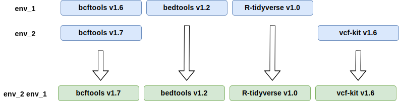

# The Andersen Lab Software Environment (no longer supported)

[TOC]

## andersen-lab-env

__Computational Reproducibility__ is the ability to reproduce an analysis exactly. In order for comutational research to be reproducible you need to keep track of the code, software, and data. We keep track of code using git and GitHub. Our starting data (usually FASTQs) is almost always static, so we don't need to track changes to the data. We perform a new analysis when data is added.

To track software we've developed the [andersen-lab-env](http://www.github.com/andersenlab/andersen-lab-env). The andersen-lab-env is a set of software environments that can be used in conjunction with the bioinformatic pipelines we have developed for Quest. These environments can be installed locally on a Mac or on Quest. The andersen-lab-env is designed to change over time, but we explicitly define the software versions, and we track changes to the environments over time.

The system is in some ways complex. This page is designed to try to explain how it works. We rely on three different tools to manage software environments. In concert they provide a lot of flexibility when it comes to setting up the software environment.

!!! note

    The software environments on Mac and Linux are not exactly identical...but they are very close.

There is an installation script you can use to install the __andersen-lab-env__, but it is recommended that you read this page before doing so.

## pyenv

__[pyenv documentation](https://github.com/pyenv/pyenv)__

`pyenv` is used to install and manage different versions of python. For example, you might have a python 3 script for one project and a python 2 script for another. You want to be able to run both scripts on your system. One option is to modify the python 2 script to work with python 3, but this is not always an option.

The solution is to be able to install __multiple__ versions of python simultaneously. `pyenv` allows you to do this. More than this, pyenv allows you to set the python version that you want to use at the local or global level.

* __local__ - Sets the python version to a specific directory.
* __global__ - Sets the python version to use everywhere unless a local version is set.

Lets look at an example of this. First, lets install two different versions of python.

```
pyenv install 2.7.11
pyenv install 3.6.0
```

Now you can see the installed versions by typing `pyenv versions`:

```
$ pyenv versions
*  system
   2.7.11
   3.6.0
```

The `*` indicates that that is the current version of python you are using. In the case above it is set to use the `system` python which is preinstalled and is often python 2.

#### Setting the global version

__Example setting the global version of python to 3.6.0__

```
pyenv global 3.6.0
```

Now when we run `python` it will use python version 3.6.0.

#### Setting the local version

__Example setting the local version of python to 2.7.11__

```
mkdir my_python2_project
cd my_python2_project
pyenv local 2.7.11
```

Now if we go into a particular directoy and type `pyenv local 2.7.11`, a `.python-version` file is created that says `2.7.11` and makes it so that directory always uses python 2.7.11.

Now lets see what this looks like:


As is illustrated above, versions are inherited from parent directories. When you `cd` to a directory, pyenv searches up through each directory looking for a `.python-version` file to identify which version of python to use. If it reaches the top before finding one it uses the global version.

__tl;dr;__ - pyenv allows us to install separate versions of python and set them at the directory level.

## pyenv-virtualenv

__[Documentation](https://github.com/pyenv/pyenv-virtualenv)__

`pyenv` lets us install multiple versions of python, and lets us use those versions locally within certain directories or globally. But what if we have two projects that use Python 2.7.11 and one requires a python module with a specific version: `networkx==1.0`. Another project the same module greater than version 2.0 `networkx>2.0`. How can we simultaneously work on both projects on the same system?

__virtualenv__ is a python tool for creating isolated python environments (also known as virtualenvs; The usage tends to be specific for python virtual environments and is short for 'virtual environment'). You can create a virtualenv for every project that you do - and these can be used to ensure that when you update or install modules for a given project that they do not interfere with each other. 

We won't be using virtualenv directly, but instead will the pyenv flavor of virtualenvs. `pyenv-virtualenv` is a tool that can create virtual environments that operate similar to the way `pyenv` python environments do. You can create virtualenvs that act globally or you can create virtualenvs that are local to a specific directory.

To create a `pyenv-virtualenv` you must provide a base python environment that you have installed and a name for the environment. For example, below 
the python environment is `2.7.11` and the name of the environment is `c_elegans_project`:

```
pyenv virtualenv 2.7.11 c_elegans_project
```

Then you can set that virtualenv to a local directory using:

```
mkdir c_elegans_project
cd c_elegans_project
pyenv local c_elegans_project
```

Notice that the folder name is the same as the virtualenv. This can be a good idea for clarity.

You can see a list of python versions and virtual environments by typing:

```
pyenv versions
```

Output:

```
    2.7.11
  * 2.7.11/envs/c_elegans_project
    3.6.0
```

Virtual environments are designated as `<version>/envs/<name>`. Now we can also install the module we need for that specific project. `pyenv` installs a python-specific package manager called `pip`:

```
pip install networkx==1.0
```

Notice that at this point we have isolated independent environments that do not interfere with one another. If we leave them alone for a year we should be able to come back and the software environment should be the same... and if they work with data they should reproduce the identical result.

__tl;dr__ - pyenv-virtualenv can define custom isolated python environments and set them the same way pyenv sets python installations.

## conda

__[Conda Documentation](http://www.conda.io)__

Thus far we've managed to install multiple versions of python and figured out how to use them in independent, isolated environments. But we obviously use a lot more than just Python. We need to be able to install things like [bcftools](https://samtools.github.io/bcftools/bcftools.html) to work with variant data. We need to be able to install Java packages, and R packages, and all kinds of software. __Conda__ can help us with this.

__Conda__ is a language-agnostic package manager. That means it can be used to install packages from python, R, Java, C/C++, etc. 

For example, the command below will install R and the [R Tidyverse](https://www.tidyverse.org/).

```
conda install r-tidyverse
```

### conda integrates with pyenv and pyenv-virtualenv

Important for our purposes, `conda` can be installed by `pyenv`. When I stated earlier that pyenv is used to install and manage versions of python I ommitted the fact that it can __also__ install conda to avoid confusion. __conda is not a version of python__, but it is written in python, and it can be used to install python modules in addition to lots of other stuff.

Similar to python virtualenvs, isolated conda environments can be created as was demonstrated above. You would run something like:

```
pyenv install miniconda3-4.3.27
pyenv virtualenv miniconda3-4.3.27 my_new_conda_env
pyenv local my_new_conda_env
conda install bcftools
pip install requests # This version of pip is specific gto 
```

What is great about these environments is that we can create custom software environments to suit any project. We can install R packages, python modules, C/C++ executables, and more.

## pyenv environments are inherited

We can now install custom environments for each project. Even better, pyenv allows you to specify multiple environments together. Consider the example in this diagram:



There are two environments defined:

__env_1__

* bcftools v1.6
* bedtools v1.2
* R-tidyverse 1.0

__env_2__

* bcftools v1.6
* vcf-kit v1.6

Those environments on their own appear in blue above.

If we were to use the following command to specify these environments:

```
pyenv local env_2 env_1 base_version
```

We would produce the green environment in the diagram. What you are seeing are two environments being combined. However, the order you specify them in matters. Notice that `bcftools v1.7` is used and not `bcftools v1.6`. This is because `env_2` is searched first when commands libraries are retrieved. After pulling all the libraries in `env_2`, the combined library will inherit anything remaining in `env_1`. This allows to easily combine environments for analysis.

Remember that each of these virtual environments is based on a version of python or conda. But you can also put a plain version of python or conda as your last environment. This is useful when using conda because the `conda` command does not inherit from conda-based virtualenvs.

## andersen-lab-env structure

The anderse-lab-env uses two conda environments:

* __primary__ - The primary environment contains the majority of the tools required for performing sequence analysis.
* __py2__ - For programs that require python 2.

You can create and use your own conda environments for projects, but these are designed to be comprehensive.

## Installing the andersen-lab-env

__If you are on Quest__

Edit your `.bashrc` file to contain the following:

```
# .bashrc
export PKG_CONFIG_PATH=/usr/share/pkgconfig:$PKG_CONFIG_PATH
# Source global definitions
if [ -f /etc/bashrc ]; then
    . /etc/bashrc
fi
```

__Installation__

The andersen-lab-env can be installed by running the following command:

```
cd && if cd ~/andersen-lab-env; then git pull; else git clone http://www.github.com/andersenlab/andersen-lab-env; fi
bash setup.sh
```

This command will clone the repo, `cd` into it, and run the `setup.sh` script. 

When you run the setup.sh script it will install the latest version of the primary and py2 environments, and it will assign these environments globally as:

```
pyenv primary-(date) py2-(date) minicondax-x.x.x
```

__You should not need to change your global environment__

!!! note

    If you have existing versions of the primary and py2 environments installed they will remain. You can set them locally at the project
    level if necessary.

## andersen-lab-env git structure

The [andersen-lab-env](https://github.com/AndersenLab/andersen-lab-env) is used to manage and version the software environments. The repo has the following structure:

```
├── Brewfile                             
├── LICENSE
├── README.md                            
├── primary.environment.yaml             
├── py2.environment.yaml                 
├── rebuild_envs.sh                      
├── setup.sh                             
├── user_bash_profile.sh
└── versions
    ├── Linux.2018-03-08.primary.yaml
    ├── Linux.2018-03-08.py2.yaml
    ├── Mac.2018-03-08.primary.yaml
    └── Mac.2018-03-08.py2.yaml
```

* __primary.environment.yaml__ - base primary environment. This lists the software to be installed, but not specific versions of it.
* __py2.environment.yaml__ - The base py2 environment. This lists the software to be installed, but not specific versions of it.
* __Brewfile__ - Defines the software software-dependencies to be installed when running `setup.sh`
* __rebuild_envs__ - Used to construct new versions of the environments. Note that you need to do this on a Linux and Mac computer.
* __user_bash_profile.sh__ - The optional bash profile that is created with `setup.sh`.
* __versions/__ - Software required for each environment with all dependencies. Versioned in git and by platform and date.

## adding new software

When you want to add new software a new version of the `primary` and `py2` environments should be created. You must modify the primary.environment.yaml or py2.environment.yaml files and build the files you see in the versions folder which define the required software by specific version and includes all the dependencies.

```
bash rebuild_envs.sh
```

This will output two new versions specific to your platform in the `versions/` folder. You must run this script and generate the appropriate version files on both Mac and Linux. Commit the updated versions to git. Other users can then install them by running the command in [installing the andersen-lab-env](#installing_the_andersen-lab-env)

