# Sharing files with Globus

[TOC]

## Setting up a share

1. Sign in to [Globus](https://app.globus.org/file-manager). The account doesn't have to be Northwestern-affiliated, but you will have to sign in with your Northwestern credentials to access Quest anyways, so might as well.
2. In "Collection", search for "Northwestern Quest", then authenticate with your Northwestern account (if you didn't already in step 1).
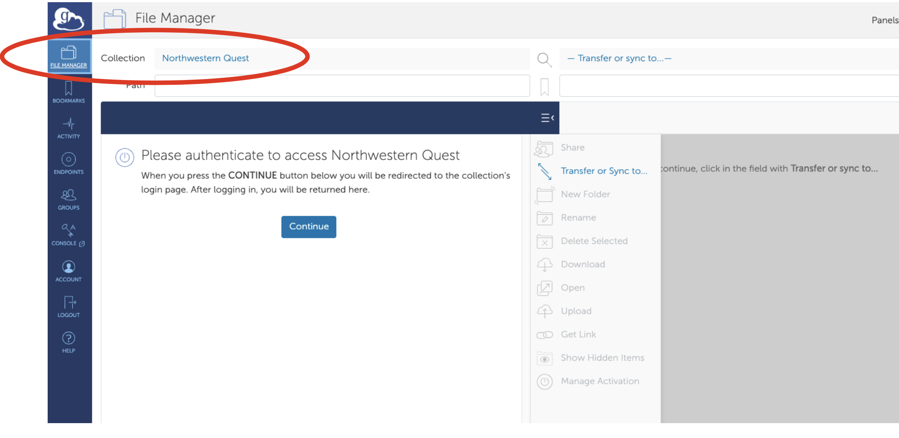
3. If you just authenticated, might need to search "Northwestern Quest" in the Collection again.
4. Navigate to the folder you want to share, click "Share", and follow the prompts.
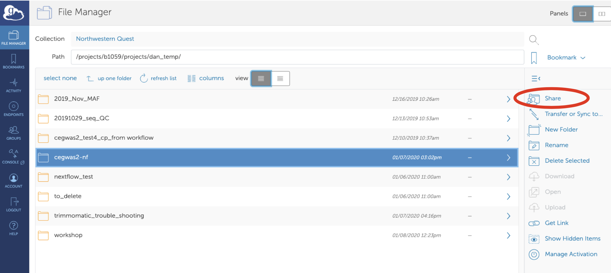
5. Click "Add Permissions - Share With" and set permissions so that all users can read.
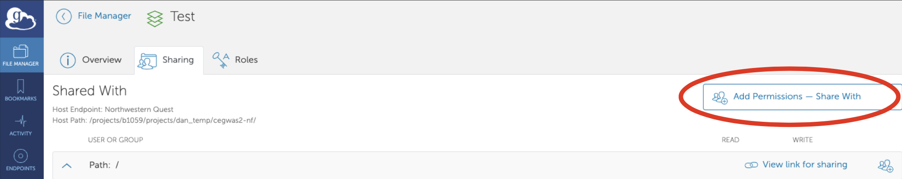
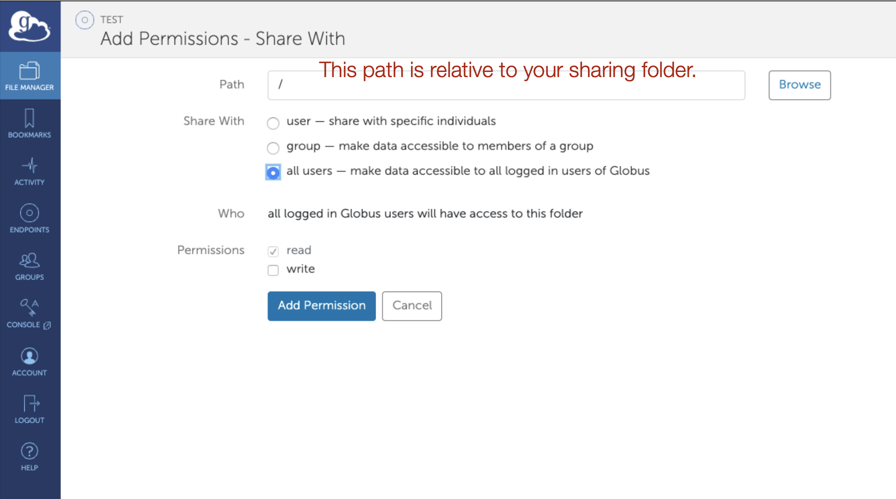
6. Click "Show link for sharing", copy the link, and send to collaborators along with the link to this page walking them through downloading the files.
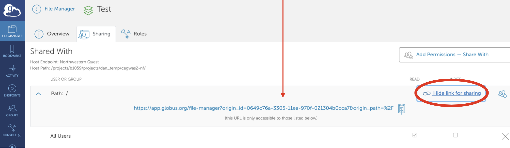

## Receiving a Globus share

1. Click on the globus link you were sent, it should take you here:
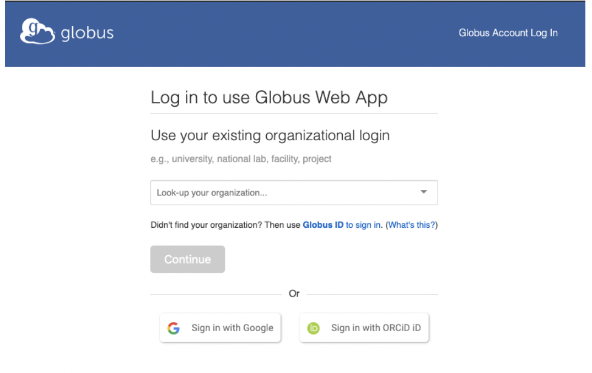
2. After you log in, the screen should look like this:
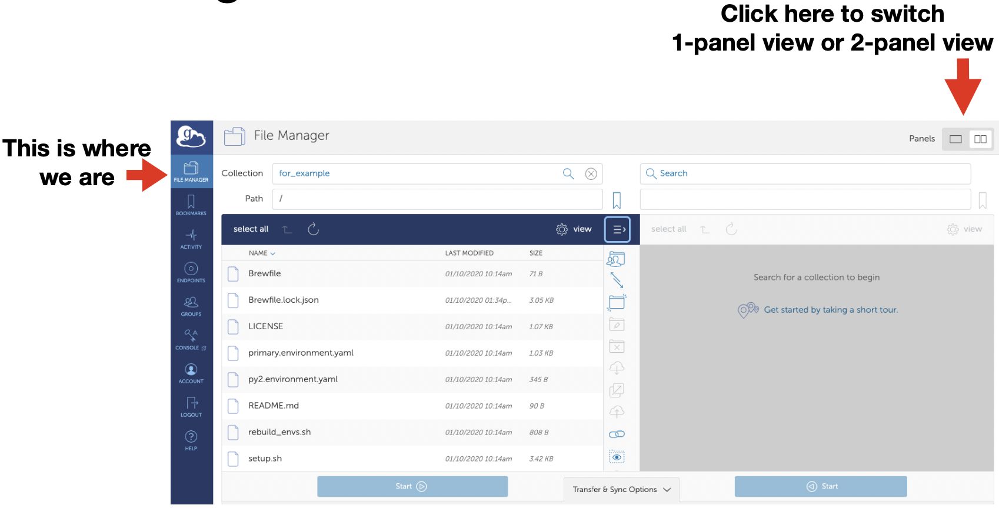
3. If you have personal Globus endpoint installed already, skip to step 6
4. Click the search bar, then "Install Globus Connect Personal"
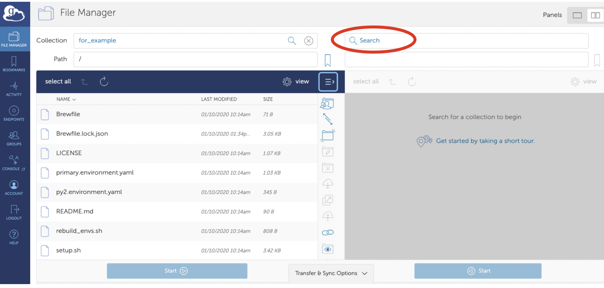
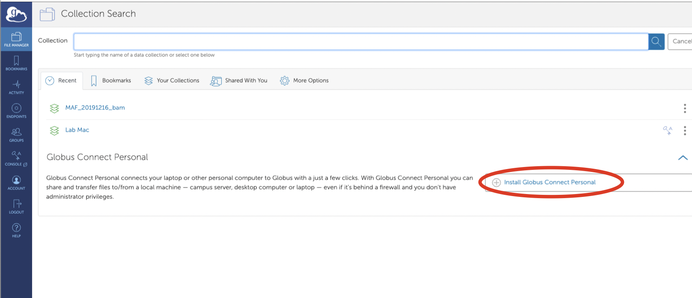
5. Follow this page and prompts to install and set up personal endpoint.
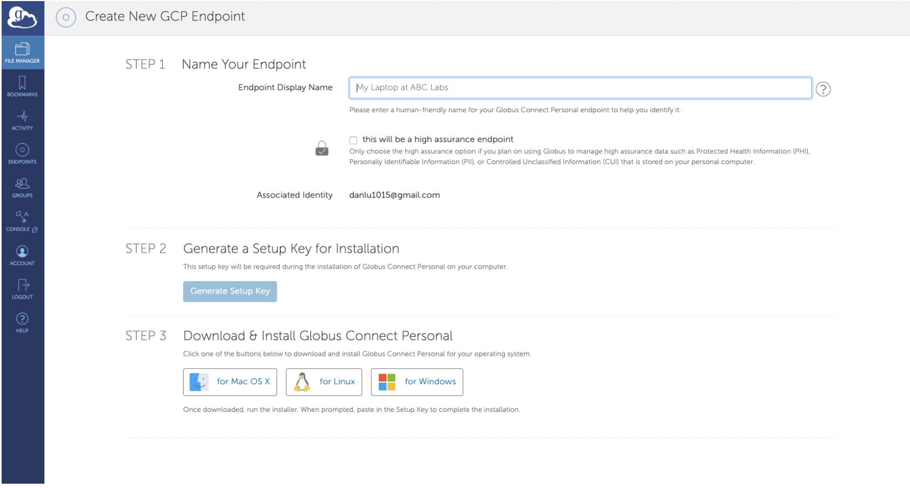
6. After installation, start Globus personal endpoint in Applications.
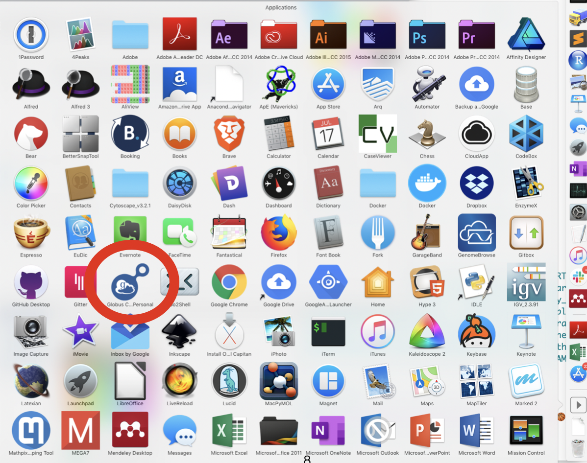
7. Nothing will seem to happen, except a new icon will appear in the upper right corner of the computer (for Macs). Click on the icon and take note of the name of your personal end point.
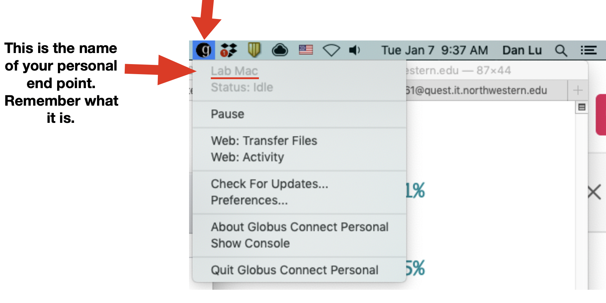
8. Click on the icon, then "Preferences". Only folders on this list can recieve files from Globus, so add new folders if necessary.
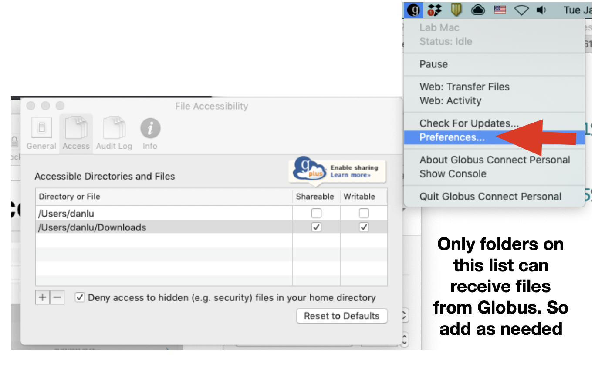
9. Go back to the internet browser and click on "File Manager" at the top left.
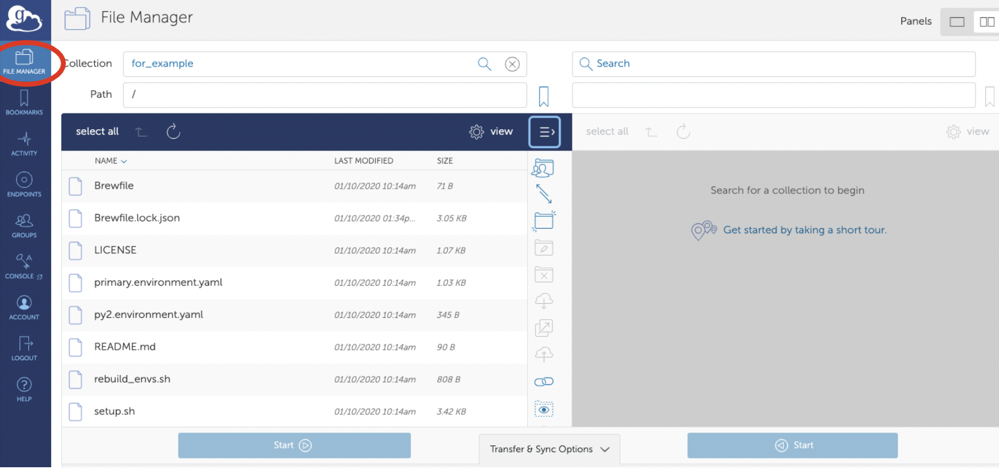
10. Click on the search bar on the right panel and type in the name of your personal end point (step), then select it.
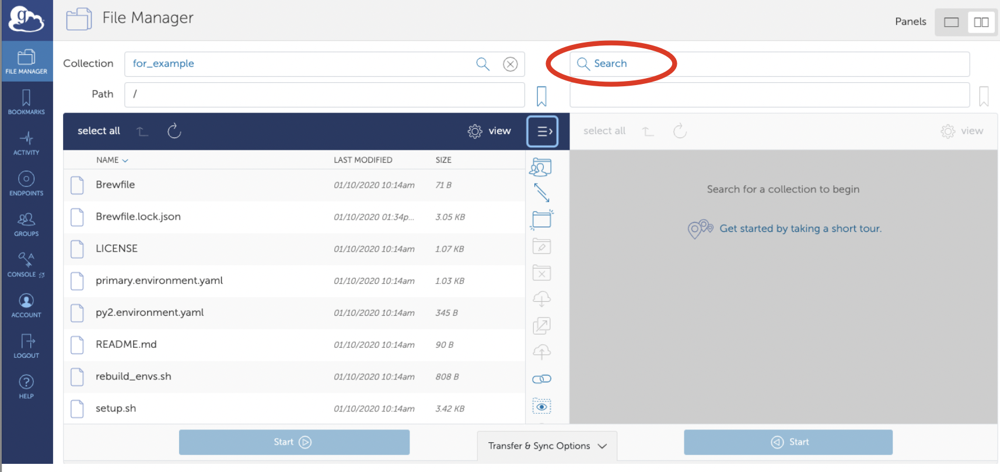
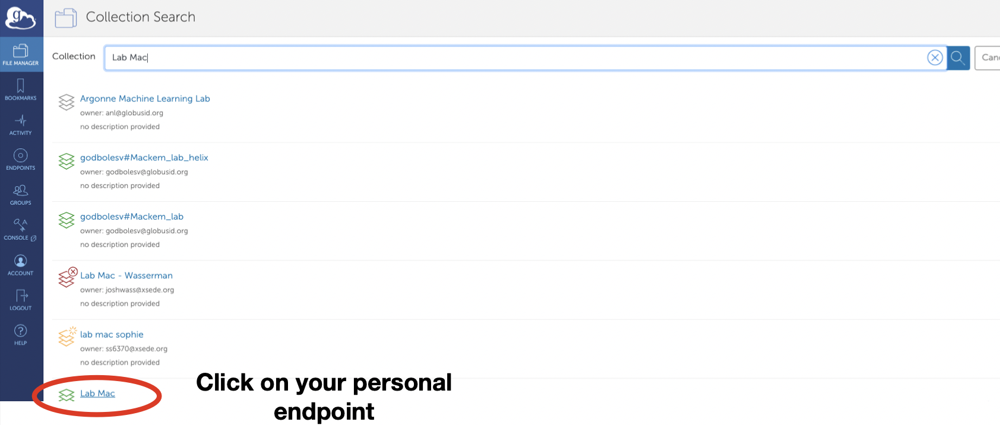
11. Select files you want to download from the left panel (they should look blue after selection), then navigate to the receiving folder on the right panel and select "Start" to begin transfer.
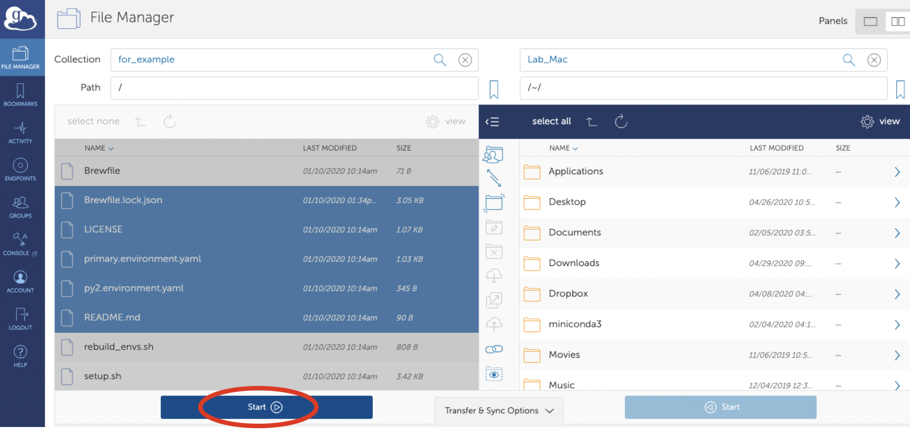

