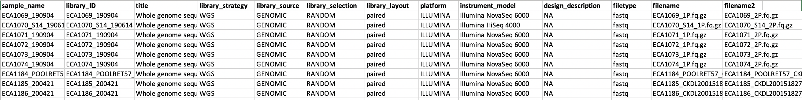

# Uploading WI FASTQ sequence data to SRA

For each CENDR release, it is important to also upload the FASTQ files to NCBI's Sequence Read Archive (SRA). **If a bioproject already exists, you can create a new submission and link to the previous bioproject**. If there is no previous bioproject, you can create a new bioproject and add all relevant data. See below for more instructions.

## SRA submission

1. **Begin submission**

* In the [SRA submission portal](https://submit.ncbi.nlm.nih.gov/subs/sra/), click the button for "New submission" and follow the prompts.
* Remember to add the previous bioproject ID if applicable to link this submission to previous submissions.
* Select "Model organism or animal" for biosample type, select "upload file using excel" and download the [template](https://www.ncbi.nlm.nih.gov/biosample/docs/templates/packages/Model.organism.animal.1.0.xlsx)

2. **Create biosample sheet (an example can be found below)**

* An easy starting point here is the sample sheet used for `alignment-nf`. You will keep the id as the sample name (unique identifier) and strain (note strain also needs to be unique - if there are multiple library preps for the same strain, please append "-2" etc. to the strain)
* To these two columns, you can add bioproject, organism, developmental stage, sex, and tissue (same across all strains)
* Finally, join this data with the WI species master sheet to get collected by, collection date, and latitude/longitude.
        - *Note: latitude/longitude need to be converted into one shared column in the format "34.89 S 56.15 W" (+ refers to North and East)*
* Copy the data into the relevent columns in the [template](https://www.ncbi.nlm.nih.gov/biosample/docs/templates/packages/Model.organism.animal.1.0.xlsx), save, and upload to the submission portal


3. **Create SRA metadata sheet**

* Again, select "upload a file using excel" and download the [template](https://ftp-trace.ncbi.nlm.nih.gov/sra/metadata_table/SRA_metadata.xlsx)
* An easy starting point here is, again, the sample sheet used for `alignment-nf`. You will keep the id as the sample name and the lb as library id. You will also keep fq1 and fq2 for filename and filename2.
* You will then add the rest of the columns as shown below. Note: the formatting is very specific for this sheet. The title can be found on the bioproject page. The instrument_model can be found by using the "sequencing_folder" (not shown, but part of the original sample sheet) and looking up the instrument that folder was run on in the Sequencing Runs google sheet ([here](https://docs.google.com/spreadsheets/d/1CpSpzU1p-WtGKIMBK99DL5AeZb-A8QrHPuLkM_fAuEY/edit#gid=0))
* Copy and paste the rows from this file into the [template](https://ftp-trace.ncbi.nlm.nih.gov/sra/metadata_table/SRA_metadata.xlsx) to check for correct formatting. Then save the tab as a tsv and upload to the submission portal.


4. **Pre-upload FASTQ files using FTP**

* Create a list of files to upload to the FTP server by combining the filename1 and filename2 from the SRA metadata sheet (above).
* Begin submission by creating an NCBI account (or signing in -- personal account). Then follow the link to the [SRA submission portal](https://submit.ncbi.nlm.nih.gov/subs/sra/)
* Follow the instructions under the "FTP upload":

```
# establish FTP connection from terminal (on QUEST!)
# ftp <address>
ftp ftp-private.ncbi.nlm.nih.gov

# navigate to your account folder (i.e.)
cd uploads/kathrynevans2015_u.northwestern.edu_YSlKSXQ4

# create new folder for submission (i.e.)
mkdir 20210121_submission

# exit FTP connection
exit

# back on quest, run the following line to transfer every file with path listed in "files_to_upload.tsv" to that folder
# make sure to change your upload folder and files to upload
module load parallel
parallel --verbose lftp -e \"put -O /uploads/kathrynevans2015_u.northwestern.edu_YSlKSXQ4/20210121_submission {}\; bye\" -u subftp,w4pYB9VQ ftp-private.ncbi.nlm.nih.gov < files_to_upload.tsv
```
    
*Note: it is important that this step is completely finished before you complete your SRA submission*

5. **Complete submission**

* When finished, in the SRA portal you will be asked to select which folder you want to pull files from
* Review and submit! If there are any issues they will let you know.

## List of current bioprojects associated with the Andersen Lab
* *C. elegans* WI genome FASTQ - PRJNA549503 (link [here](https://trace.ncbi.nlm.nih.gov/Traces/study/?acc=SRP201794&o=acc_s%3Aa))